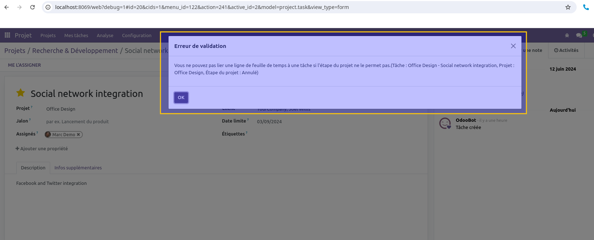

Project Stage Allow Timesheet
=============================

This module adds the notion of time sheet on project stages.
With this implementation, the field allow_timesheets on project is now readonly and it
is driven by the stage the project is in.

*I go on the project stage configuration. I find an option to* ``Allow Timesheet`` *on tasks in this stage.*

*On the list view, the* ``Allow Timesheet`` *field is also visible.*

Additionally, the module implements two new constraints that avoid to move time sheets in a project that does not
allow time sheets.

*It is now forbidden to move a task with time sheets to a project that does not allow time sheets.*

*It is not forbidden to move a time sheet into another task if the project does not allow time sheets.*

Contributors
------------
* Numigi (tm) and all its contributors (https://bit.ly/numigiens)
