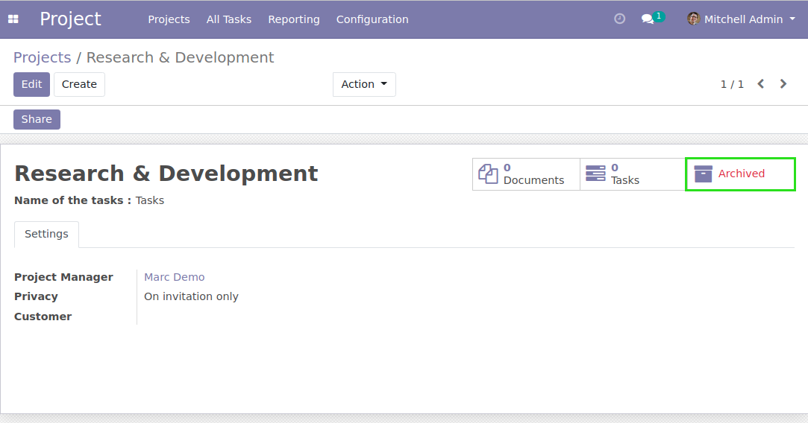
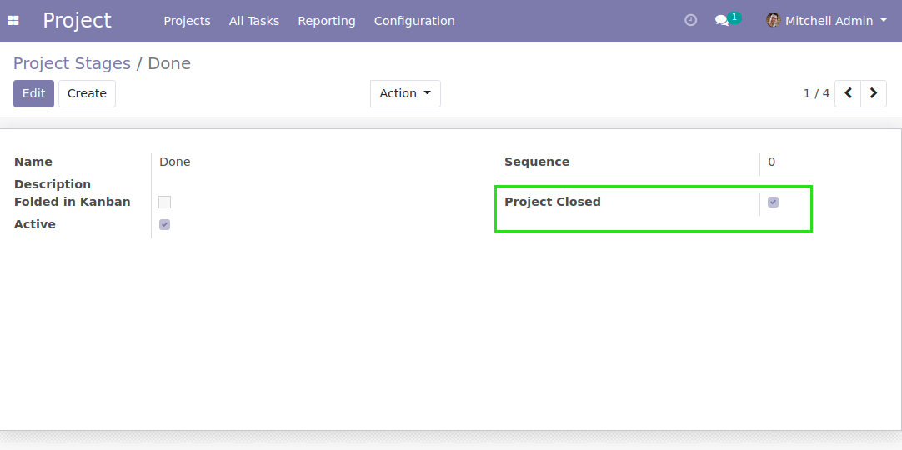
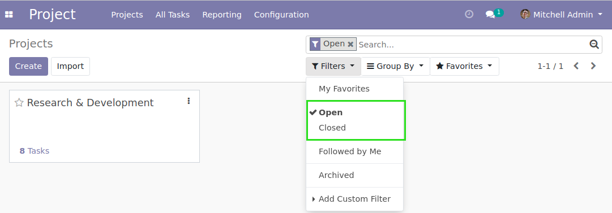
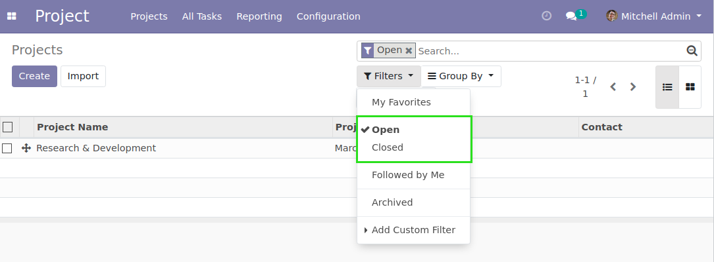

Project Closed
==============

.. contents:: Table of Contents

Context
-------
In vanilla Odoo, a project can be archived.

However, this feature has multiple side effects:

* All tasks in the project are automatically archived
* The project may not anymore be selected in any many2one field
* The timesheets do not appear anymore in the project overview report

Overview
--------
This module adds a checkbox ``Closed Project`` on project stages.

In the kanban and list view of projects, two new filters are available.

* Open: shows project with an open stage
* Closed: shows project with a closed stage

By default, the ``Open`` filter is selected.

Contributors
------------
* Numigi (tm) and all its contributors (https://bit.ly/numigiens)
