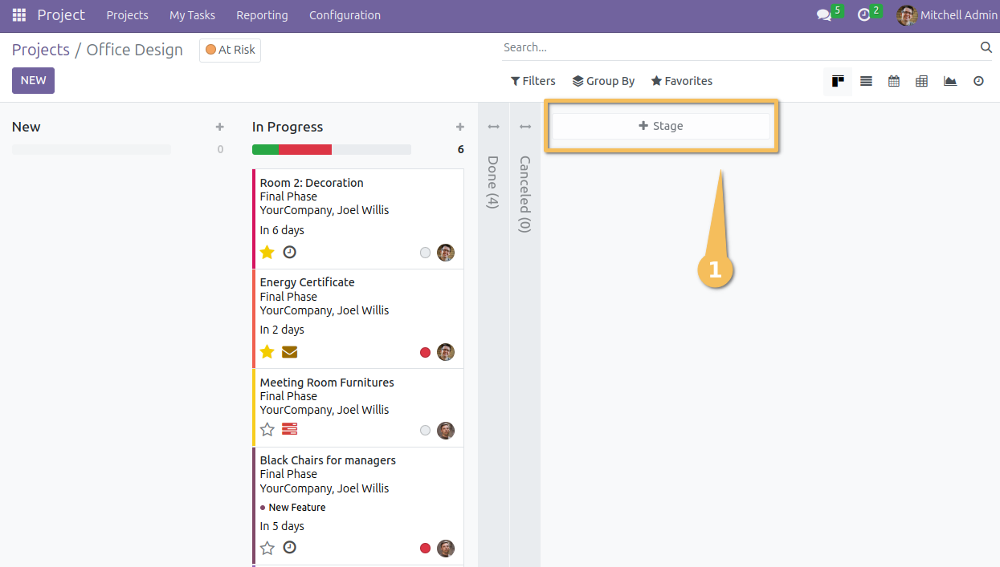
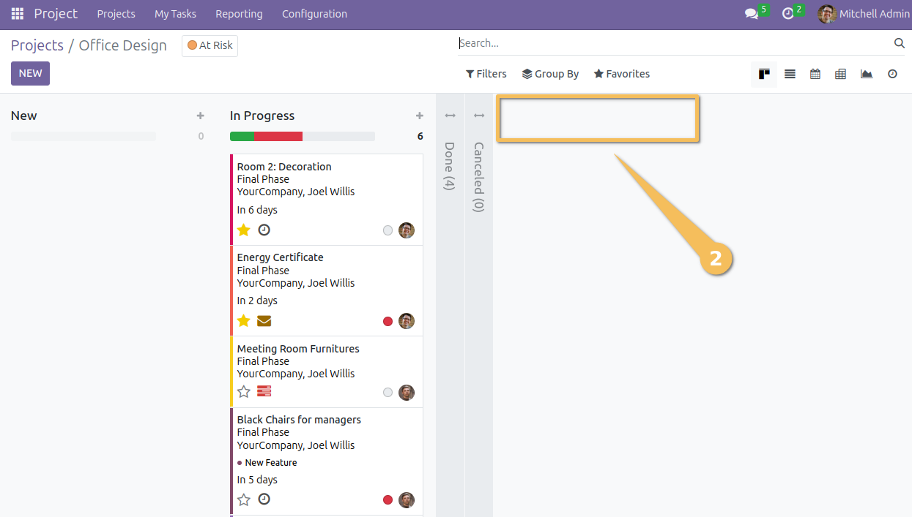
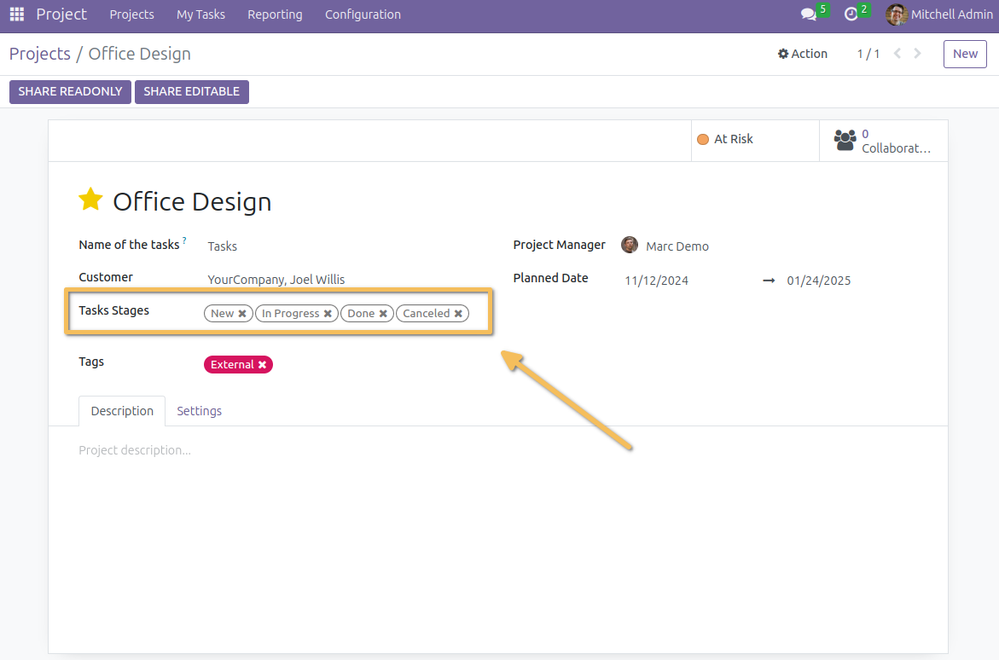
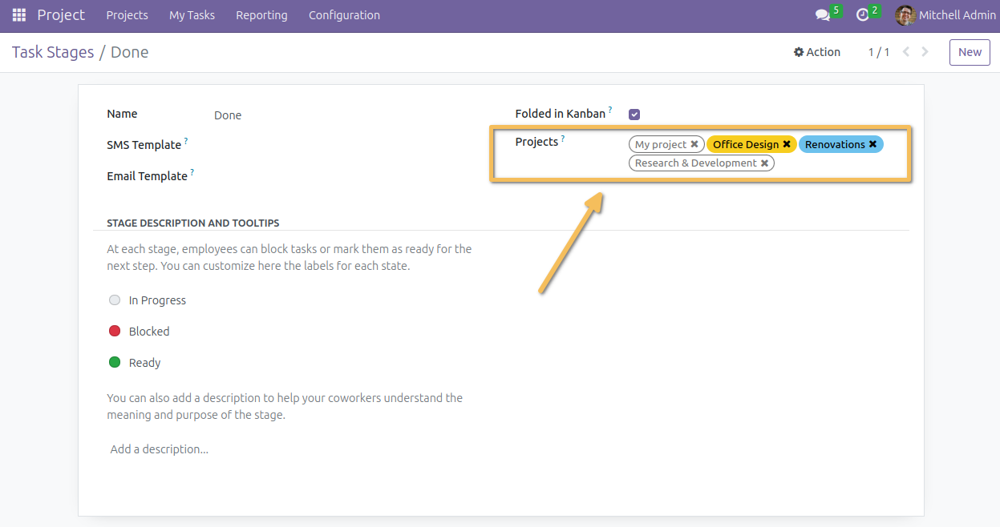
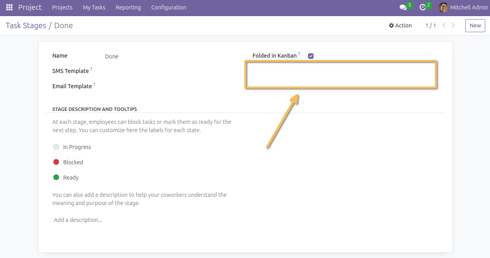
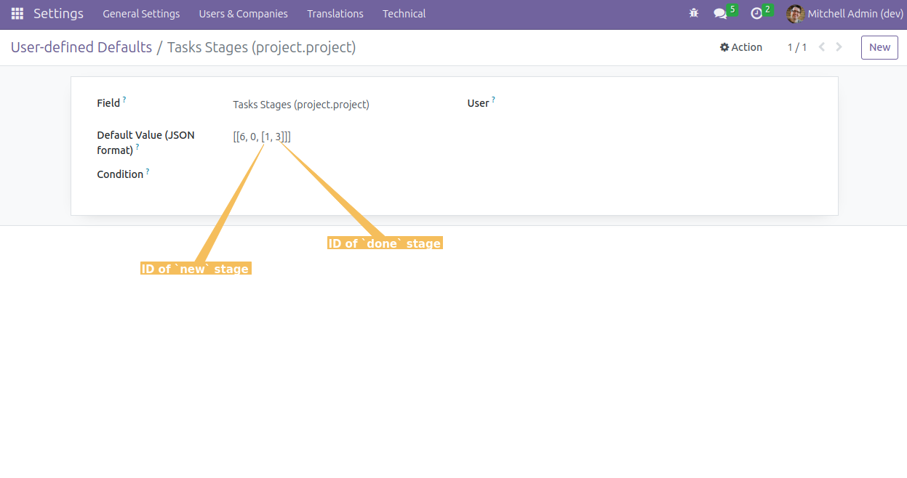
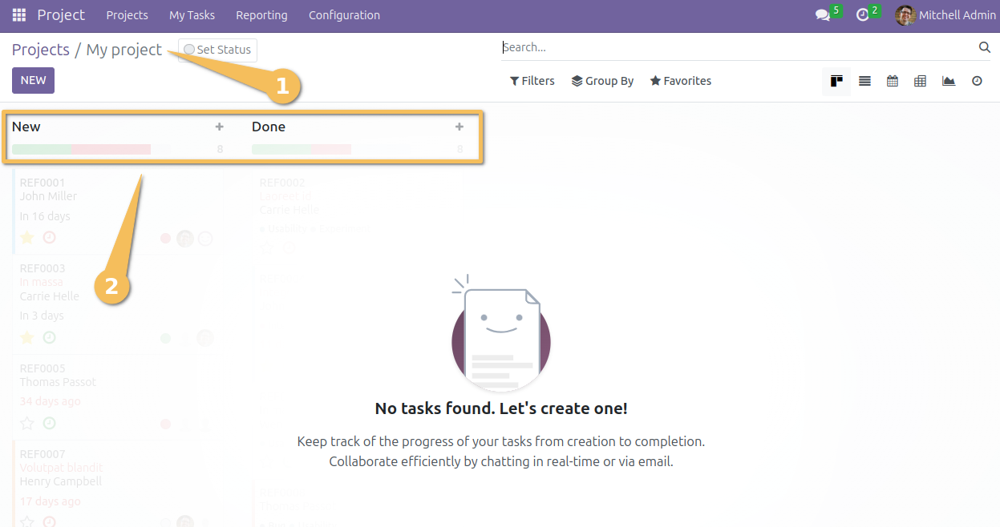

Project Stage No Quick Create
=============================

This module prevents the quick creation of project stages.

*Before installing the module*:

*After installing the module*:

It also add the field `type_ids` (Task Stages) on the project form.

It also remove the view of all project linked to the project stage, only in form view.
It is always in the tree view.

*Before installing the module*:

*After installing the module*:

Same Stages for All Projects
----------------------------
If you need to have the same stages for all project:

* Activate the developer mode.
* Go to /Settings/Technical/Actions/User-defined Defaults.
* Click on `Create`.
* In `Field` select `Tasks Stages (project.project)`.
* In `Default Value (JSON format)` enter `[[6, 0, [n1, n2, ..., n]]]`
  where [n1, n2, ..., n] is the list of ids of the stages.

Example:

After creating a new project with the previous configuration, the default stages will be as follows:

Whenever you want to update the default stages, you may edit this default value.

Contributors
------------
* Numigi (tm) and all its contributors (https://bit.ly/numigiens)
* Istvan Szalai (istvan.szalai@savoirfairelinux.com)

More information
----------------
* Meet us at https://bit.ly/numigi-com
