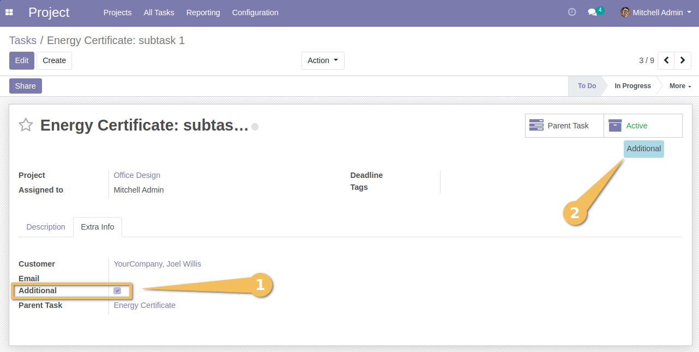
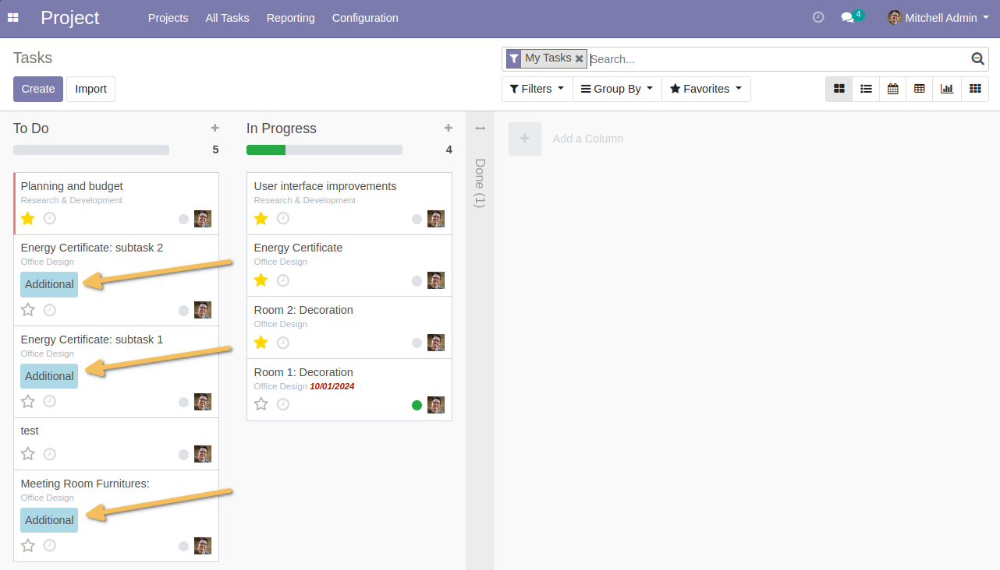
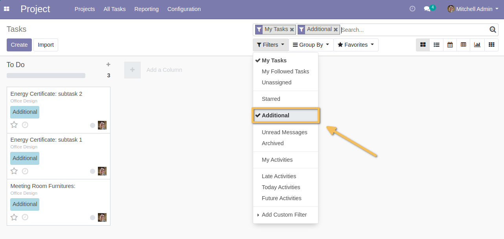

=============================
Project Task Additional Tasks
=============================
This module allow to distinguish additional costs from the initial quote in order to potentially be able to re-invoice these new costs to the client.

Usage
-----
As a user in the project app, I navigate to a task to create a subtask.

Once on the form view of the `Additional` task :

1. I find a new check box to mark that the task is Additional. This box is automatically checked if I create a subtask from the parent task.
2. If the task is checked an `Additional`, a label is displayed at the top of the task to clearly identify that it is an `Additional`

When I create a task using the usual menu and I attach it to a parent task, then the `Additional` checkbox appears checked by default.

On the kanban view, I also have visibility of `Additional` tasks thanks to a label.

Contributors
------------
* Numigi (tm) and all its contributors (https://bit.ly/numigiens)
