Project Task Analytic Lines
===========================

.. contents:: Table of Contents

Odoo Context
------------
In vanilla Odoo, analytic lines can not be grouped or filtered by task, except for timesheet lines.

Therefore, if you need to generate a cost report, only the timesheet lines will be shown per task.

Summary
-------
This module adds a `Task` field on supplier invoices lines and journal entries.

The task is propagated:

1. from invoice lines to journal entries
2. from journal entries to analytic lines

Then, the analytic lines can be filtered and grouped by task.

Journal Entries
---------------
As member of the group `Accounting / Billing`, on a draft journal entry, I find a new field `Task`.

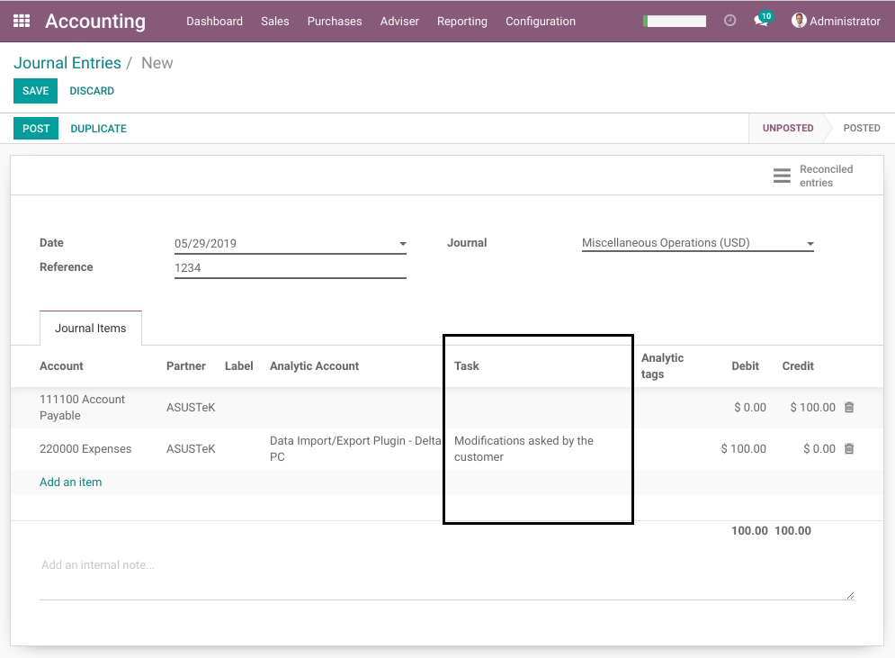

The field is readonly if the analytic account is not filled.

.. image:: static/description/journal_entry_task_readonly.png

If a project is selected, I am able to select a task related to this project.

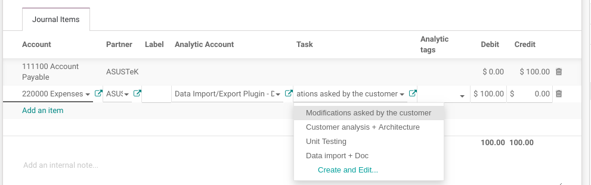

I post the journal entry.

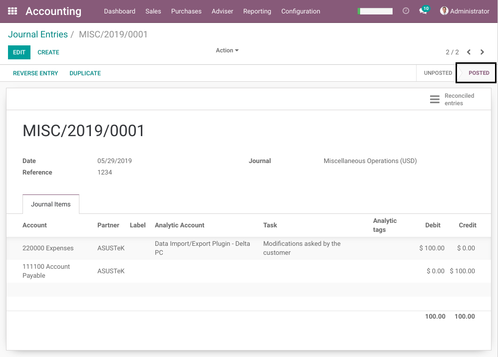

In the list of analytic lines, I notice that the task was propagated.

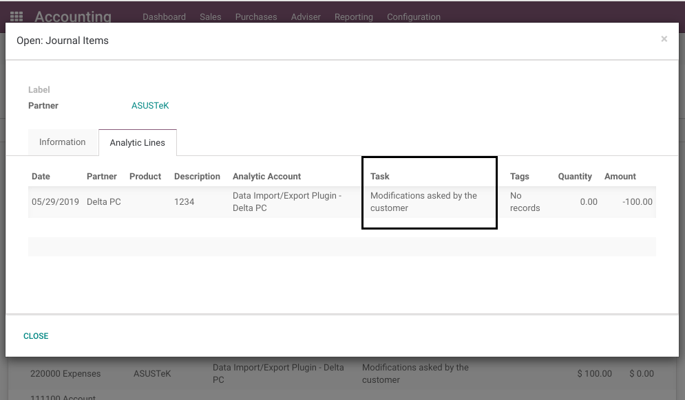

Supplier Invoices
-----------------
As member of the group `Accounting / Billing`, on a draft supplier invoice, I find a new field `Task`.

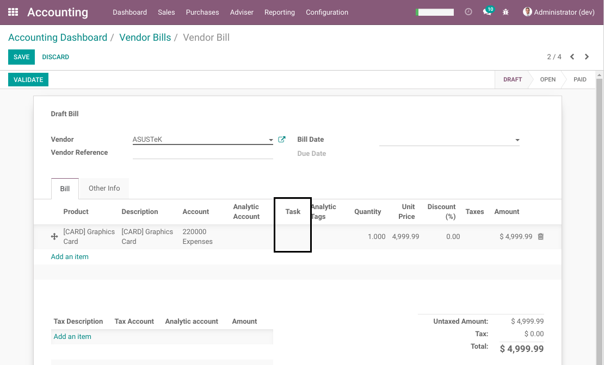

The field is readonly if the analytic account is not filled.

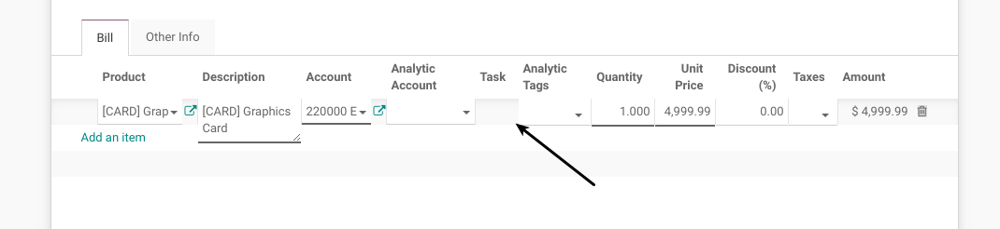

If a project is selected, I am able to select a task related to this project.

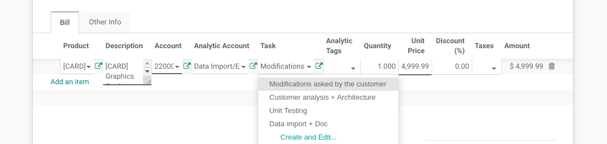

I validate the invoice.

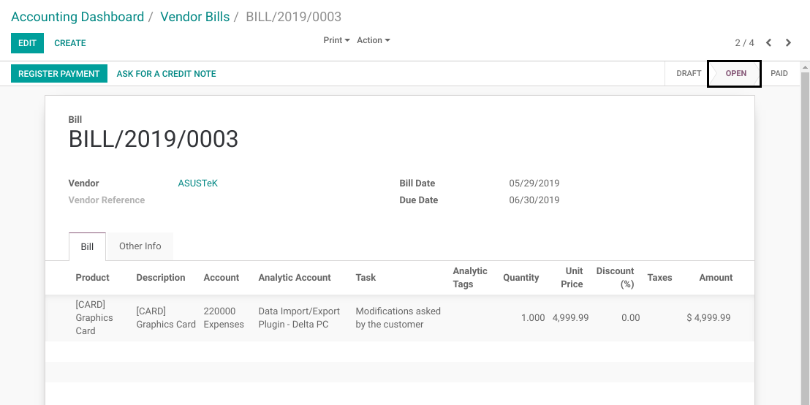

On the journal entry, I notice that the task was propagated to the expense line.

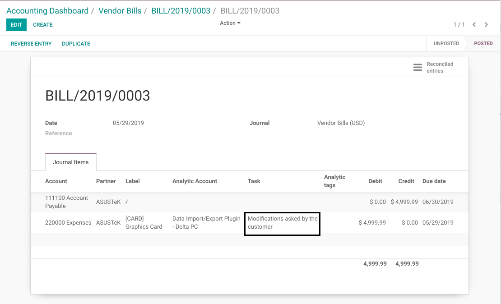

In the list of analytic lines, I notice that the task was propagated.

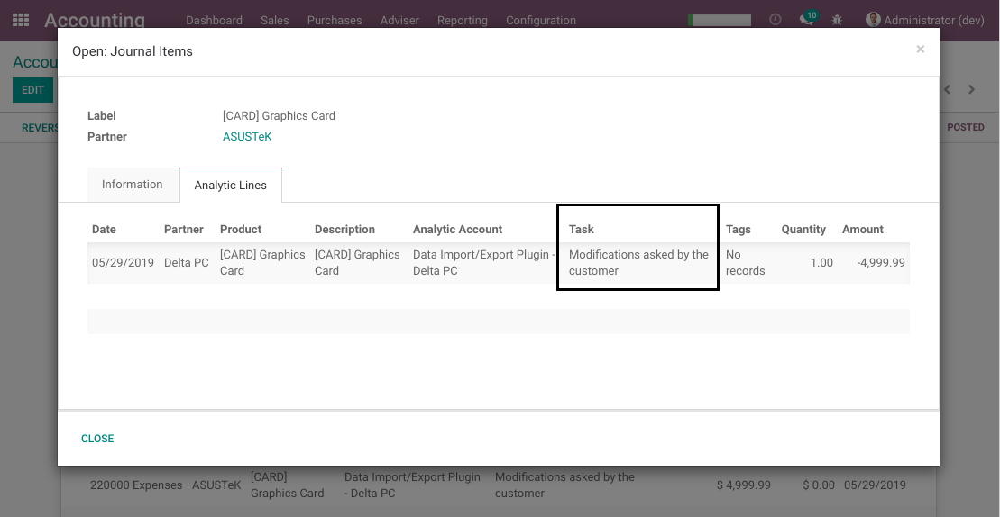

Analytic Lines
--------------
In the list of analytic lines, I see a new field `Task`.

..

    A new technical field (origin_task_id) was added because the field task_id
    available in vanilla Odoo could not be used.

    The field task_id is used by Odoo for timesheet lines.
    If task_id was used for any other purpose, some standard functionalities would be broken.

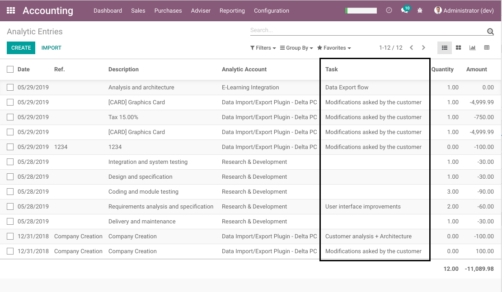

I am able to search by task:

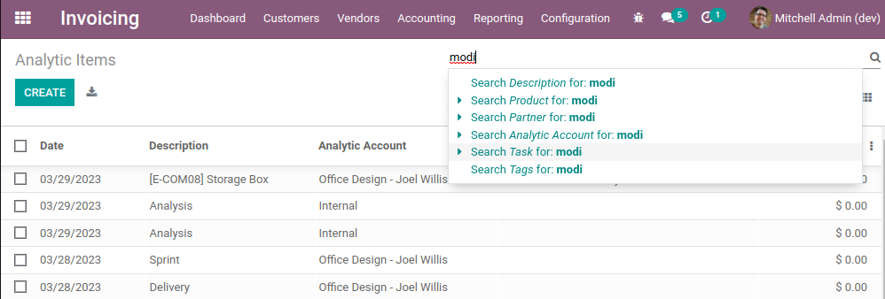

I am able to group by task:

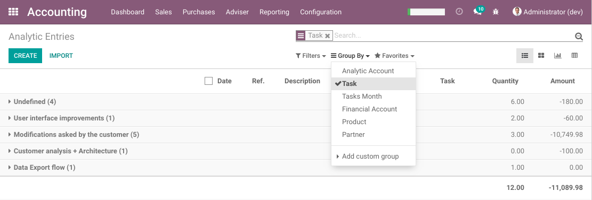

Limits
------

Purchase Orders
~~~~~~~~~~~~~~~
This module does not define how tasks are propagated from a purchase order to a supplier invoice.

The module `project_wip_outsourcing` inherits this module and adds the business logic related to outsourcing.
For now, outsourcing is the only known case where defining a task on a PO is relevant.

Stockable Products
~~~~~~~~~~~~~~~~~~
An analytic account and a task should not be set on a supplier invoice for stockable products.
The expense for a stockable product is recognized in Odoo at the customer invoice validation.

The module is intended for services (or even consummable products).

However, the module does not constrain on which type of product a task can be used.

Contributors
------------
* Numigi (tm) and all its contributors (https://bit.ly/numigiens)
