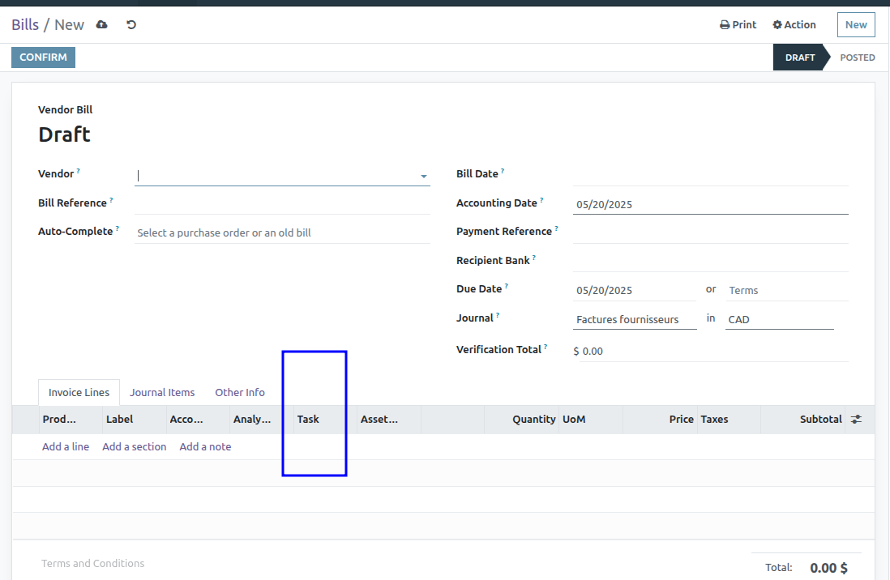
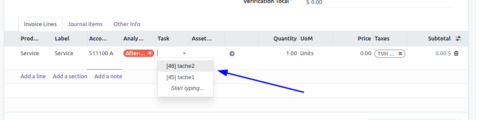
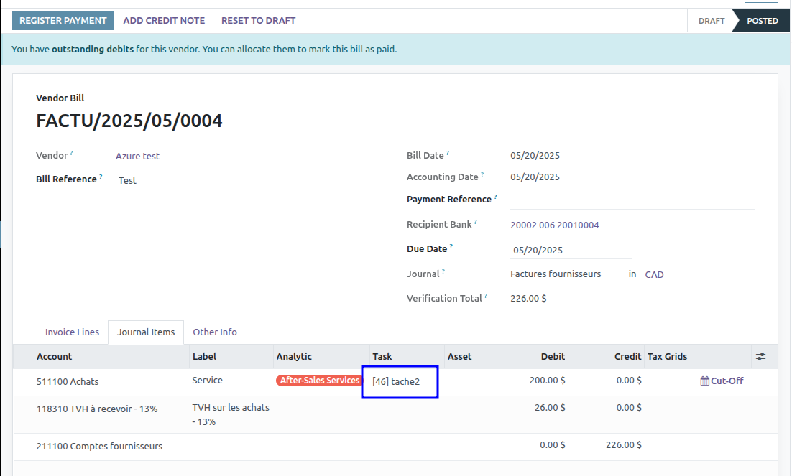
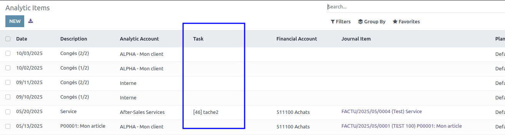
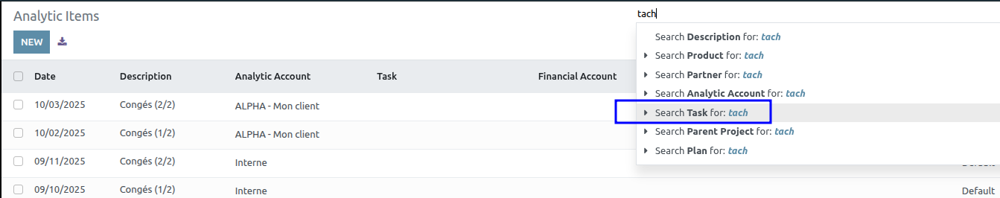
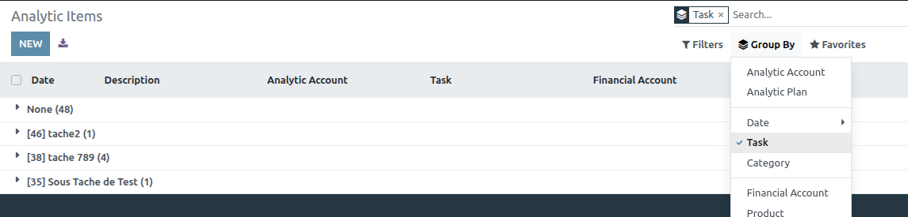
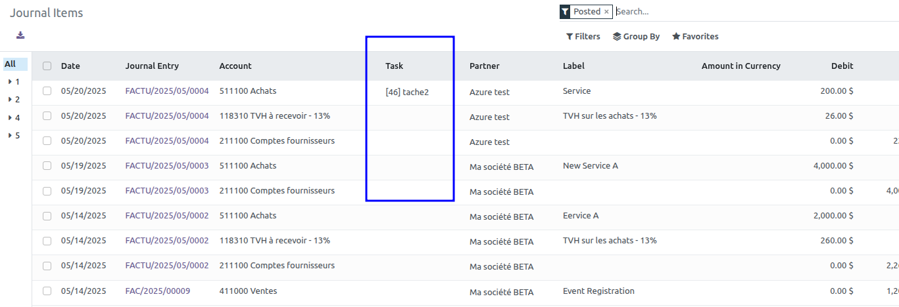
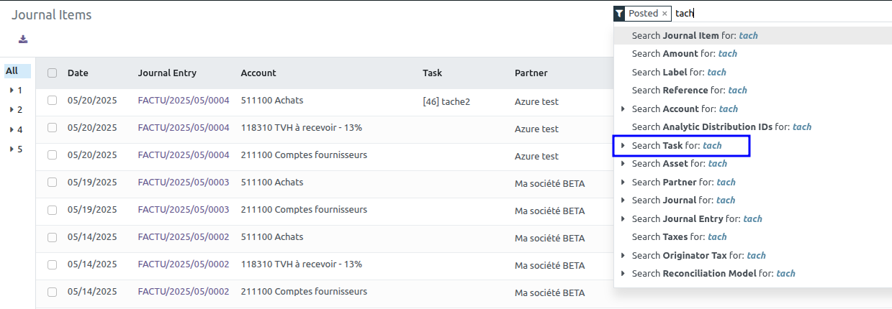
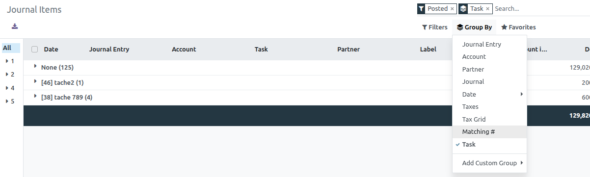
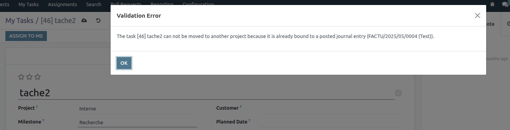

Project Task Analytic Lines
===========================

.. contents:: Table of Contents

Odoo Context
------------
In vanilla Odoo, analytic lines can not be grouped or filtered by task, except for timesheet lines.

Therefore, if you need to generate a cost report, only the timesheet lines will be shown per task.

Summary
-------
This module adds a `Task` field on supplier invoice lines and journal entries.

The task is propagated from invoice lines to journal entries and analytic lines

Then, the analytic lines can be filtered and grouped by task.

Invoices
--------
As member of the group `Accounting / Billing`, on a draft invoice, I find a new field `Task`.

If an analytic account is selected, I am able to select a task related to project of the analytic account.

On the journal Items tab, I notice that the task was propagated to the expense line.

List Views Filters
------------------

Analytic Lines
~~~~~~~~~~~~~~
In the list of analytic lines, I see a new field `Task`.

..

    A new technical field (origin_task_id) was added because the field task_id
    available in vanilla Odoo could not be used.

    The field task_id is used by Odoo for timesheet lines.
    If task_id was used for any other purpose, some standard functionalities would be broken

I am able to search by task:

I am able to group by task:

Journal Items
~~~~~~~~~~~~~
In the list view of journal items, I see a new field `Task`.

I am able to search by task:

I am able to group by task:

Constraints
-----------
Once a task is selected on an invoice, it is not possible to move the task to another project.

Otherwise, when changing the project on the task, a blocking message is displayed.

Limits
------

Stockable Products
~~~~~~~~~~~~~~~~~~
An analytic account and a task should not be set on a supplier invoice for stockable products.
The expense for a stockable product is recognized in Odoo at the customer invoice validation.

The module is intended for services (or even consummable products).

However, the module does not constrain on which type of product a task can be used.

Contributors
------------
* Numigi (tm) and all its contributors (https://bit.ly/numigiens)
