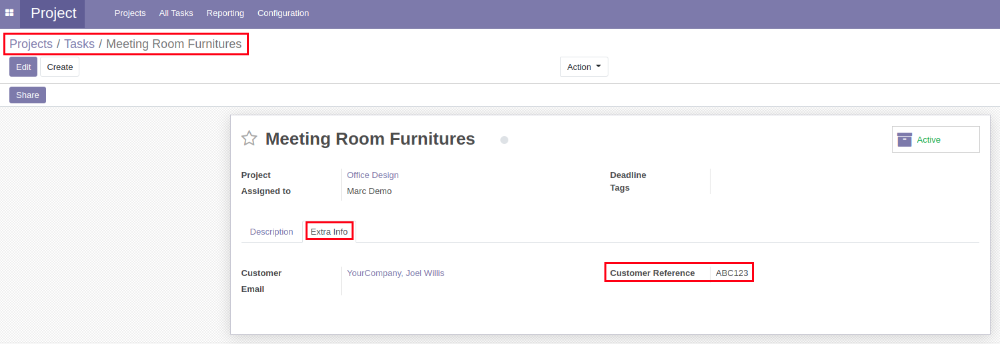
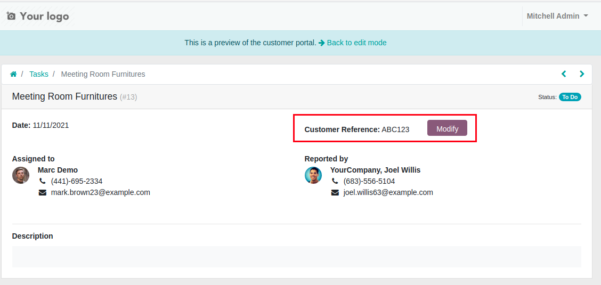
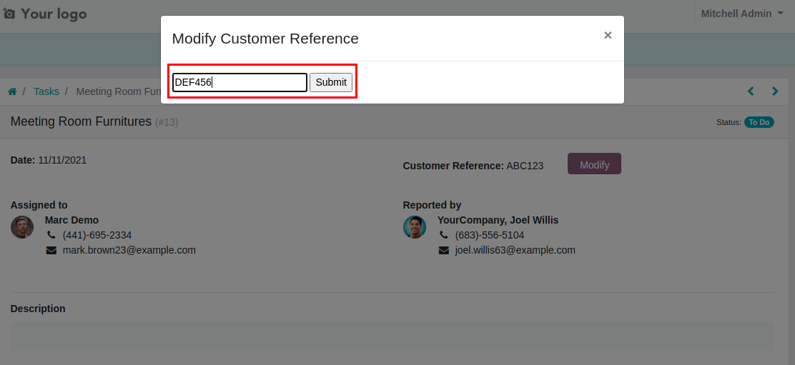
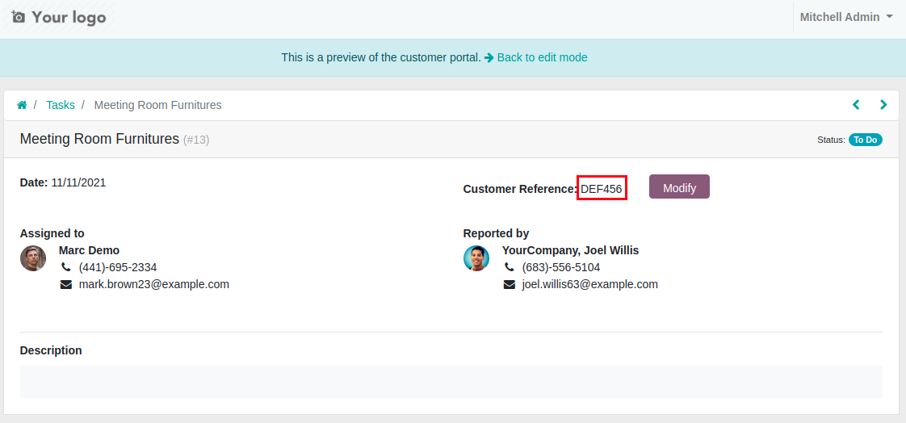

Project Task Customer Reference
===============================

.. contents:: Table of Contents

Usage
-----
This module adds a customer reference field to project tasks under the "Extra Info" tab.

This customer reference can also be updated in the portal view by clicking on "Modify".

You can then enter the new customer reference and submit, which will update the customer reference.

Contributors
------------
* Numigi (tm) and all its contributors (https://bit.ly/numigiens)

More information
----------------
* Meet us at https://bit.ly/numigi-com
