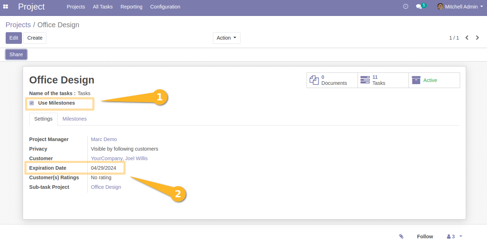
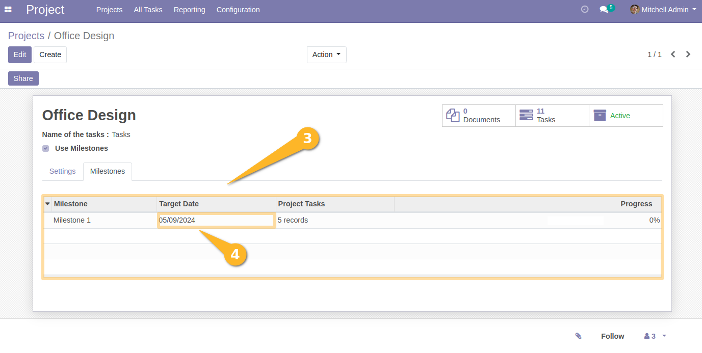
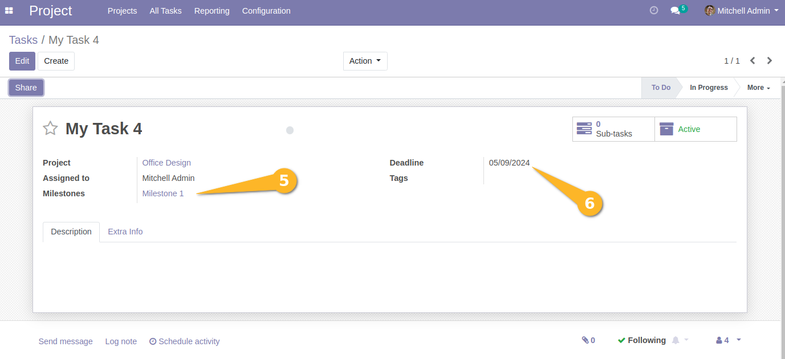

Project Task Deadline from Milestone
====================================
This module makes tasks to default to the project due date when not linked to a specific milestone,
but then move to the milestone due date once they are linked to it.

Usage
-----
When a user creates a task at a project level and then links this task to a milestone,
The due date (or deadline) corresponds to the target date of the relevant milestone.

*Rules*
All the following rules are applied:
-If the task is associated with a milestone, by default, the value of the deadline field takes
the value of the target date of the milestone.
-If the task is not associated with a milestone, then it takes the value of the end date of the project.
-If the task is existing and not assigned to a milestone, and is subsequently assigned to a milestone,
the existing value of the deadline field is overwritten in favor of the milestone's target date.

Contributors
------------
* Numigi (tm) and all its contributors (https://bit.ly/numigiens)
