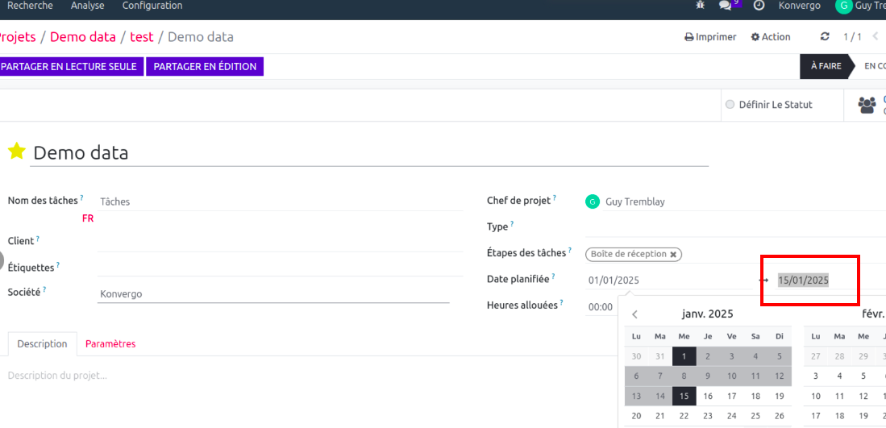
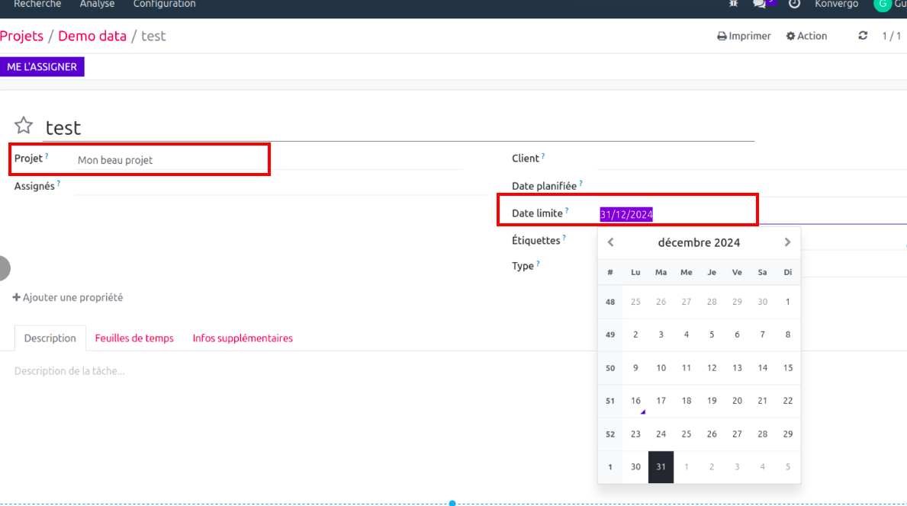

Project Task Deadline From Project
==================================
This module automatically sets the deadline on a task from the project's deadline.

When changing the task from one project to another, the deadline is automatically changed.

If the destination project has no deadline, then, the deadline on the task is emptied.

The deadline on a task can always be changed manually.

As a project manager, I set a deadline date on the project form view

When a task is created  on the project, deadline date will automatically set tfrom the project's deadline.

.. image:: static/description/deadline_task.png

When changing the task from one project to another, the deadline is automatically changed.

    
If the destination project has no deadline, then, the deadline on the task is emptied.

The deadline on a task can always be changed manually.

Contributors
------------
* Numigi (tm) and all its contributors (https://bit.ly/numigiens)
