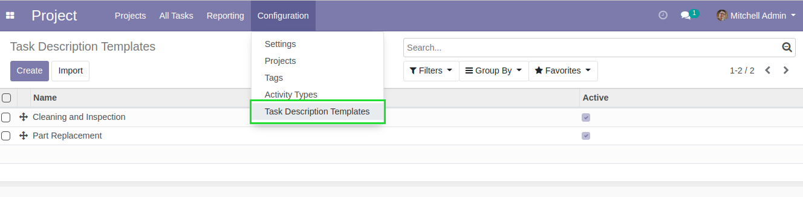
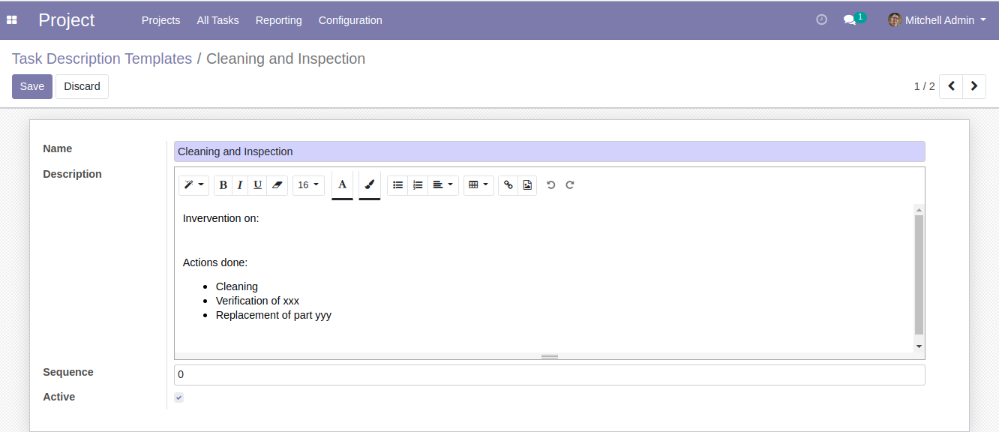
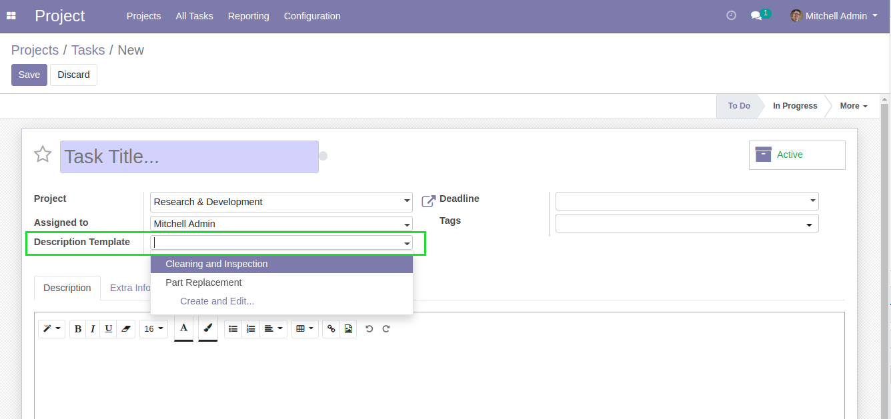
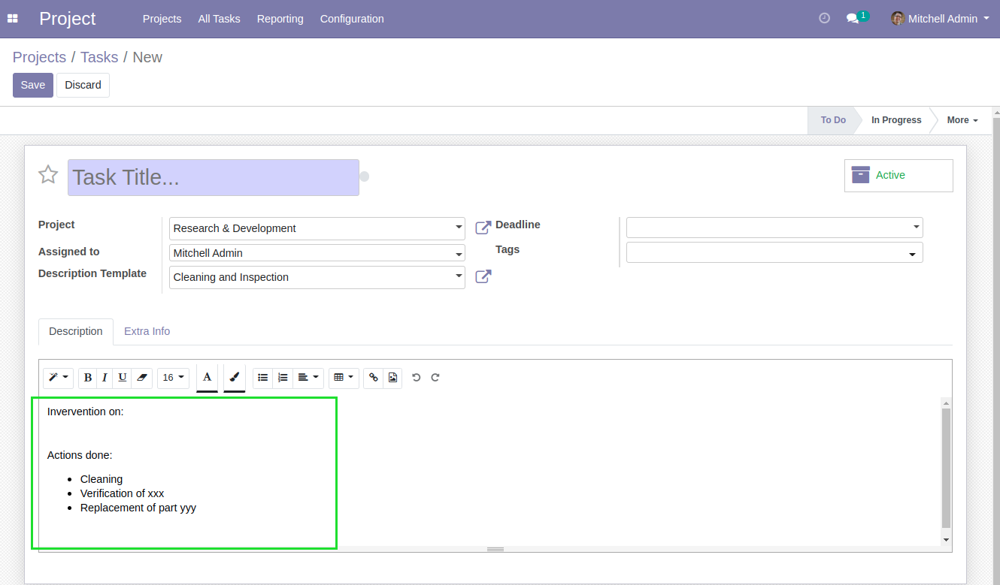

Project Task Description Templates
==================================
This module allows to autocomplete descriptions on tasks.

.. contents:: Table of Contents

Context
-------
When using ``Projects`` for field interventions, the description of tasks is very repetitive.
It is therefore convenient to automatically fill the description with a template.

Usage
-----
As ``Project / Manager``, I go to ``Proejct / Configuration / Task Description Templates``.

I find the list of description templates.

Each record contains a name andd a HTML description.

In the form view of a task, I can select a description template.

The description is automatically copied from the template.

Contributors
------------
* Numigi (tm) and all its contributors (https://bit.ly/numigiens)
