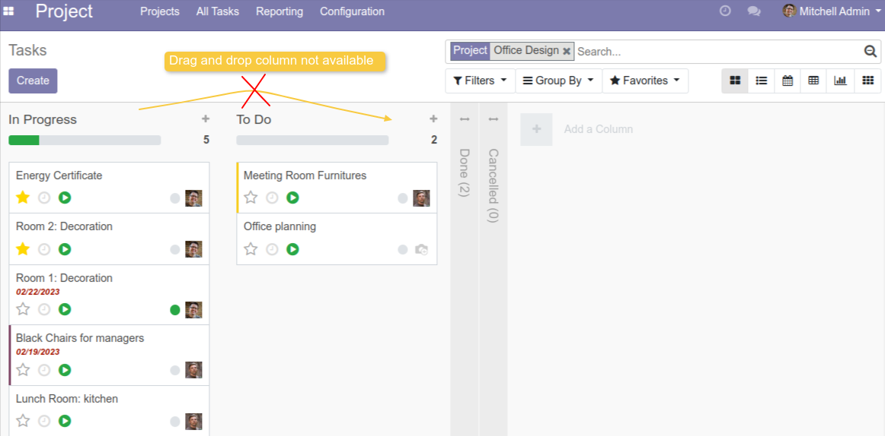

Project Task Kanban draggable column disable
============================================

.. contents:: Table of Contents

Context
-------
The module block the drag and drop on the ``stage`` column in kanban view of project task.

This is to prevent all user to accidentally change the sequence of stage.

Usage
-----
As user with access to project application, go to `Projects` then click on one record.
It will show a list of task linked to this project in a kanban view.

In the task kanban view, the drag and drop column is no longer available.

Contributors
------------
* Numigi (tm) and all its contributors (https://bit.ly/numigiens)

More information
----------------
* Meet us at https://bit.ly/numigi-com
