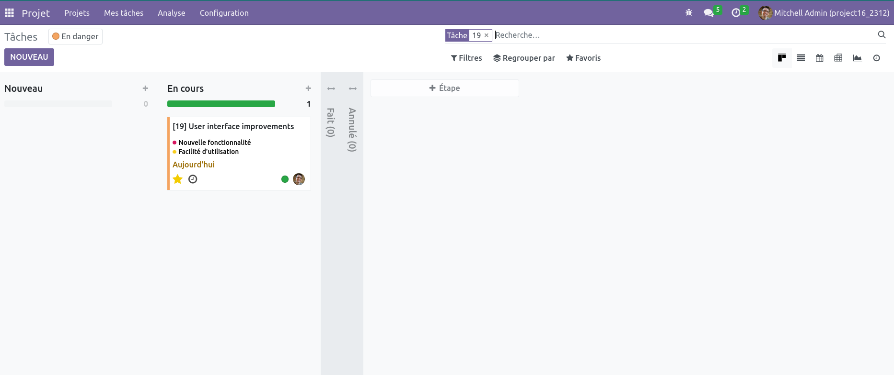
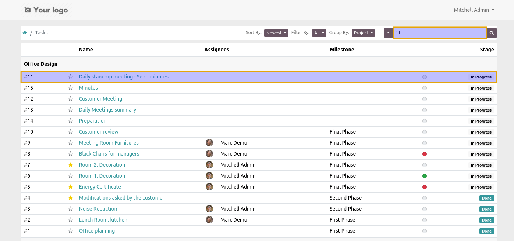

Project Task ID In Display Name
===============================
This module displays the ID of a task in its displayed name.

Searching a Task by Its ID
--------------------------
This module allows searching for a task using its ID both in the search bar of the kanban view and on the portal.  

In the kanban view, simply enter the task ID in the search bar. The system will locate and display the corresponding task if the entered ID matches. 

On the portal, entering the task ID in the search bar will redirect you directly to the ticket corresponding to the provided ID.  

Contributors
------------
* Numigi (tm) and all its contributors (https://bit.ly/numigiens)
