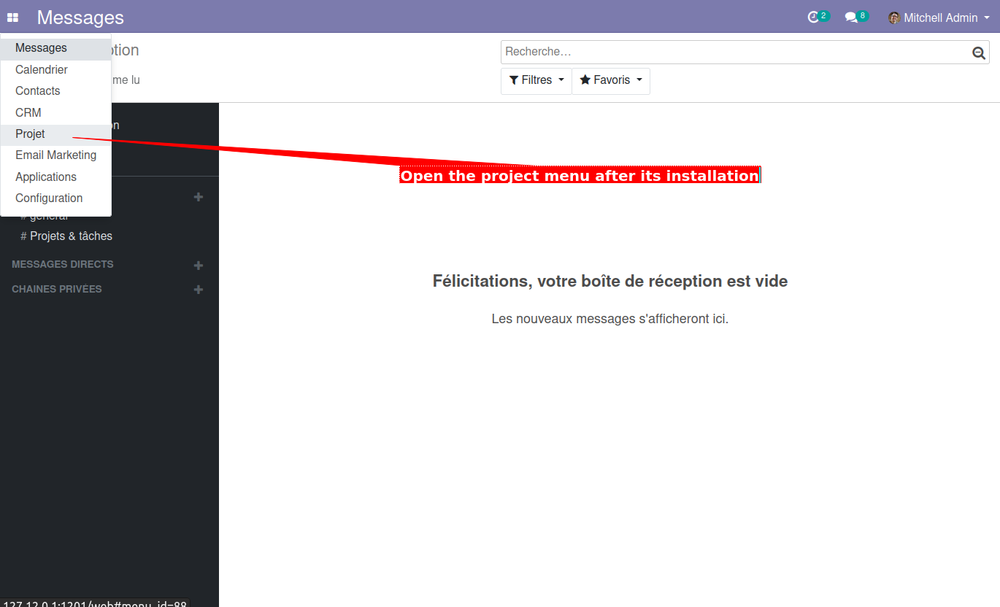
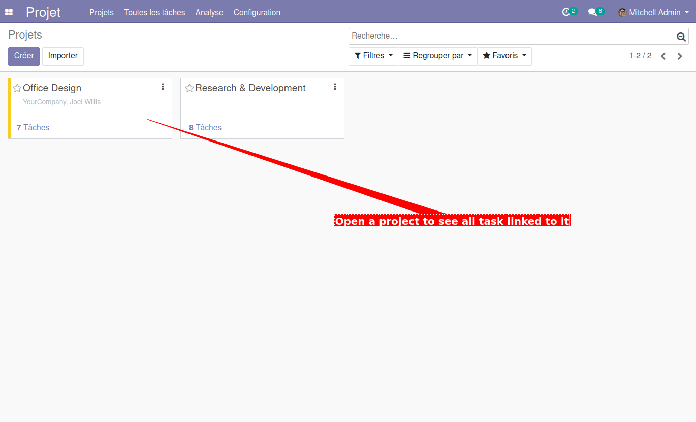
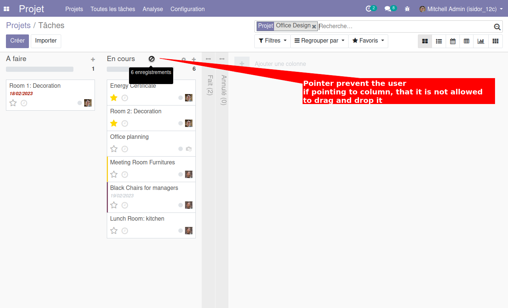
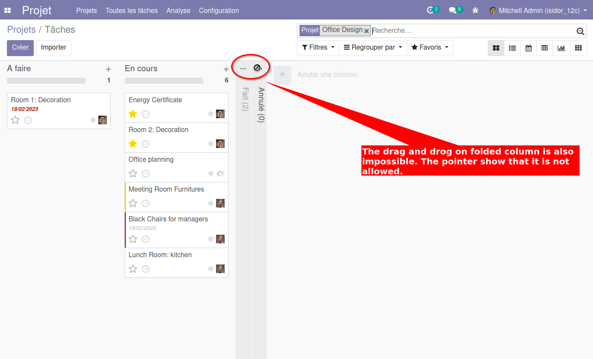
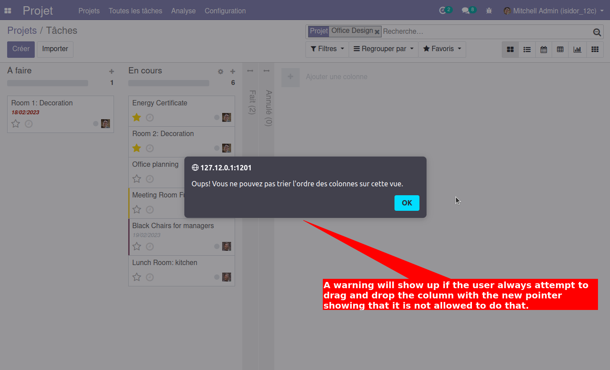

Project Task Kanban Sequence Fixed
==================================

.. contents:: Table of Contents

Context
-------
The module ``project_task_kanban_sequence_fixed`` will block the drag and drop on the ``stage`` column in kanban view of project task.

This is to prevent all user to accidentally change the sequence of stage.

Usage
-----
Make sure that project is installed. So I have the main project menu.

After that, I go to project then click on one record. It will show a list of task linked to this project in a kanban view.

In the kanban view, the pointer will change to ``not allowed`` style when attempting to drag and drop the column.

Same thing if attempting to drag and drop a folded column.

A pop-up will be show if I am always trying to drag and drop the column.

Contributors
------------
* Numigi (tm) and all its contributors (https://bit.ly/numigiens)
