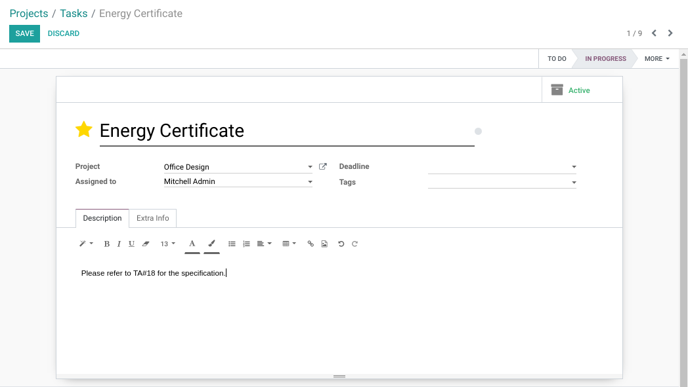
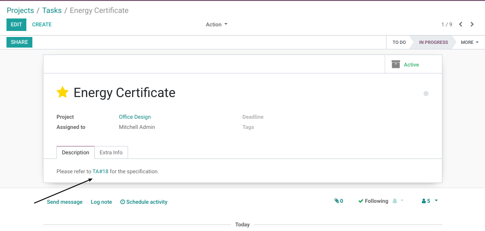
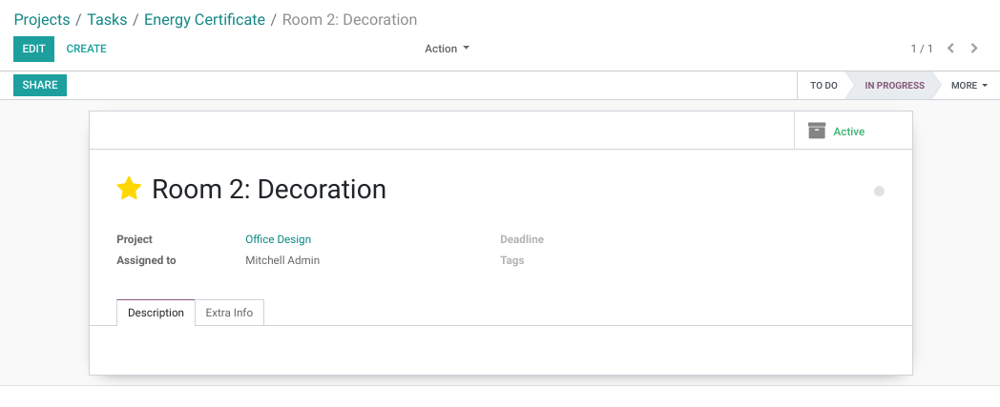
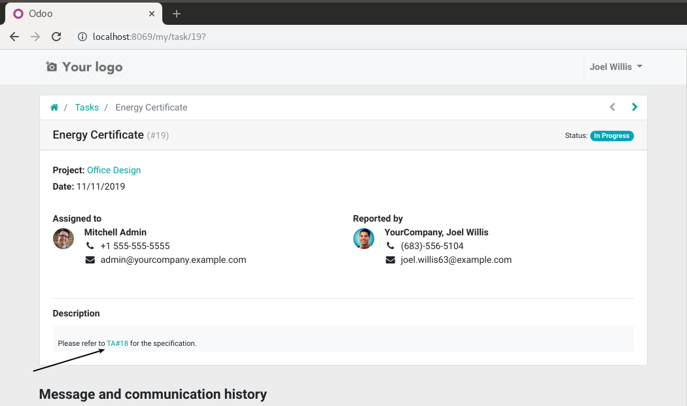
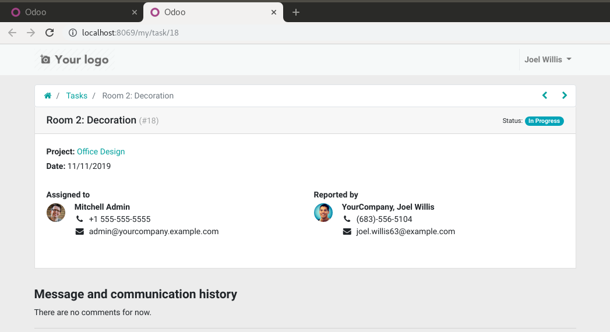

Project Task Link
=================
This module allows to insert dynamic links in the descriptions of tasks.

.. contents:: Table of Contents

Overview
--------
As member of the group ``Project / User``, I go the form view of a task.

.. image:: static/description/task_form.png

In the description, I need to reference the task ID=18.
Therefore, I write ``TA#18`` in the description.

When I save, I notice that a link was inserted dynamically.

If I click on the link, the referenced task is open.

Portal
~~~~~~
As user of the portal, I go to the form view of the task.

When I click on a dynamic link, the referenced task is open in a new window.

Advanced Setup
--------------
By default, the system uses the following regex to detect where to insert dynamic links:

..

    [Tt][Aa]\#?\d+

This means that inserting either ``TA#123``, ``ta#123``, ``TA123`` or ``ta123``
will generate a link that point to the task with ID=123.

The link will always be formatted ``TA#123``.

This can be tweeked by defining 2 system parameters:

* ``project_task_link.task_ref_regex``: the REGEX used to parse the task reference.
* ``project_task_link.task_ref_format``: the python format to use for formatting the link.

For example, let's suppose the format for our links must be: ``[ST#123]``.
The system parameters could be as follow:

* ``project_task_link.task_ref_regex``: ``\[?[sS][tT]#?\d+\]?``
* ``project_task_link.task_ref_format``: ``[ST#{task_id}]``

The regular expression must contain one and only one group of digits (``\d+``).
These digits form the database ID of the task.

The link format should contain {task_id}, which is the database ID of the task.

Contributors
------------
* Numigi (tm) and all its contributors (https://bit.ly/numigiens)
