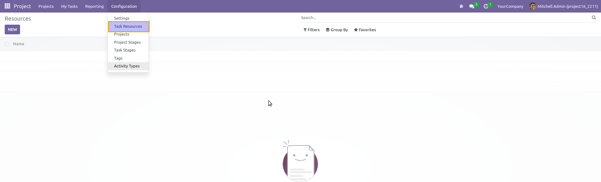
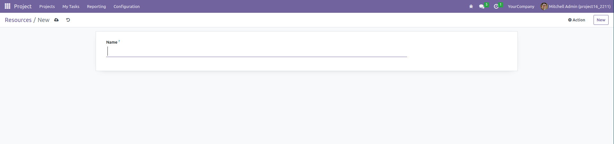
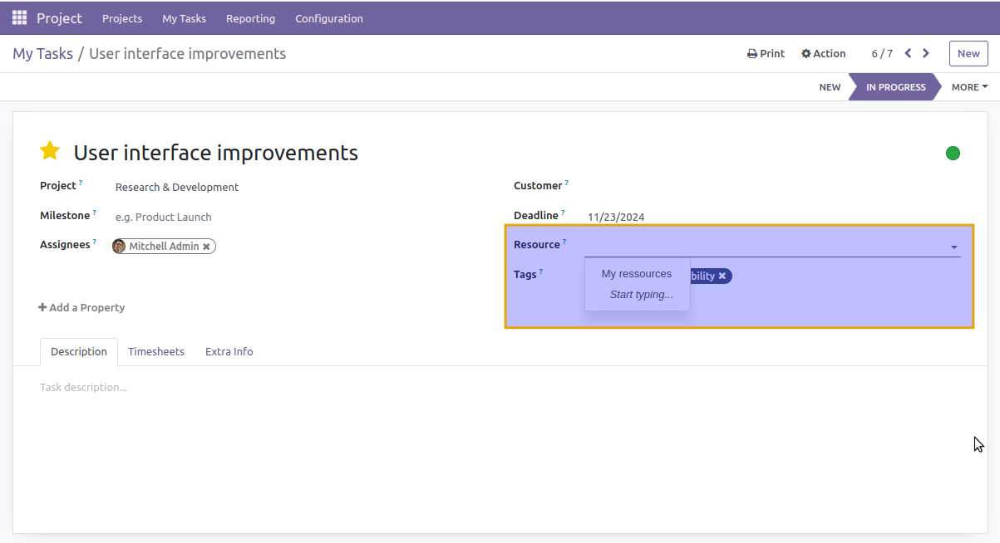

================================
Project Task Resource Type
================================
This module adds a new model for Resources and a field to associate resources with tasks.

Resources can be defined in **Project > Configuration > Resources**.

From there, you can create a new resource type:

Once a resource type is created, you can assign it to a task:

Usage
-----
* Navigate to **Projects / Configuration / Resources** to define a resource type.
* Create a new resource type and assign it to tasks through the task form.

Contributors
------------
* Numigi (tm) and all its contributors (https://bit.ly/numigiens)

More Information
----------------
* Meet us at https://bit.ly/numigi-com
