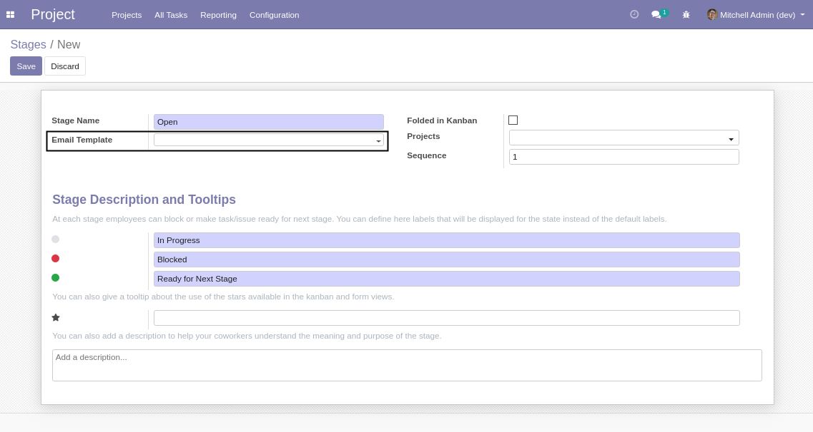
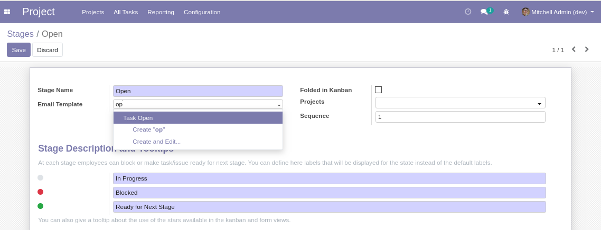
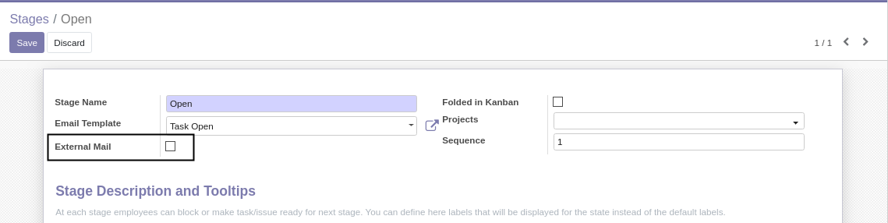
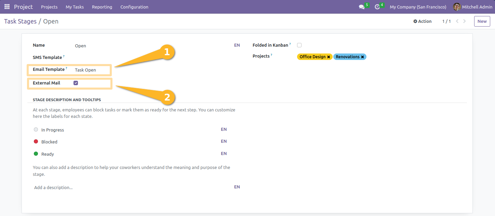
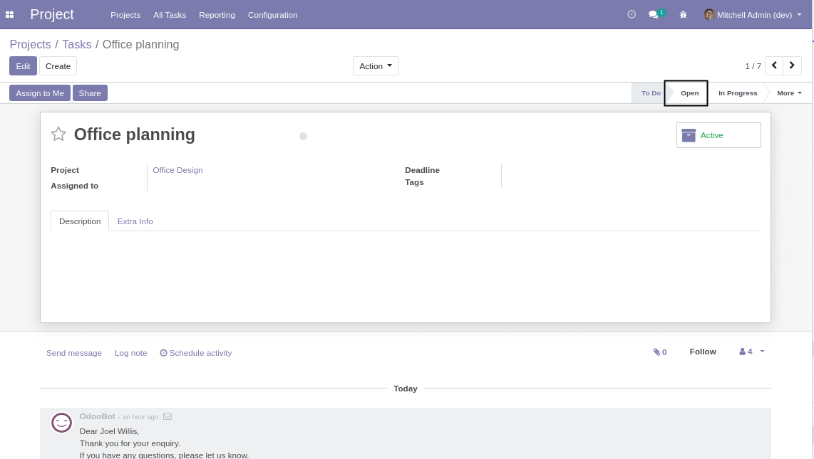
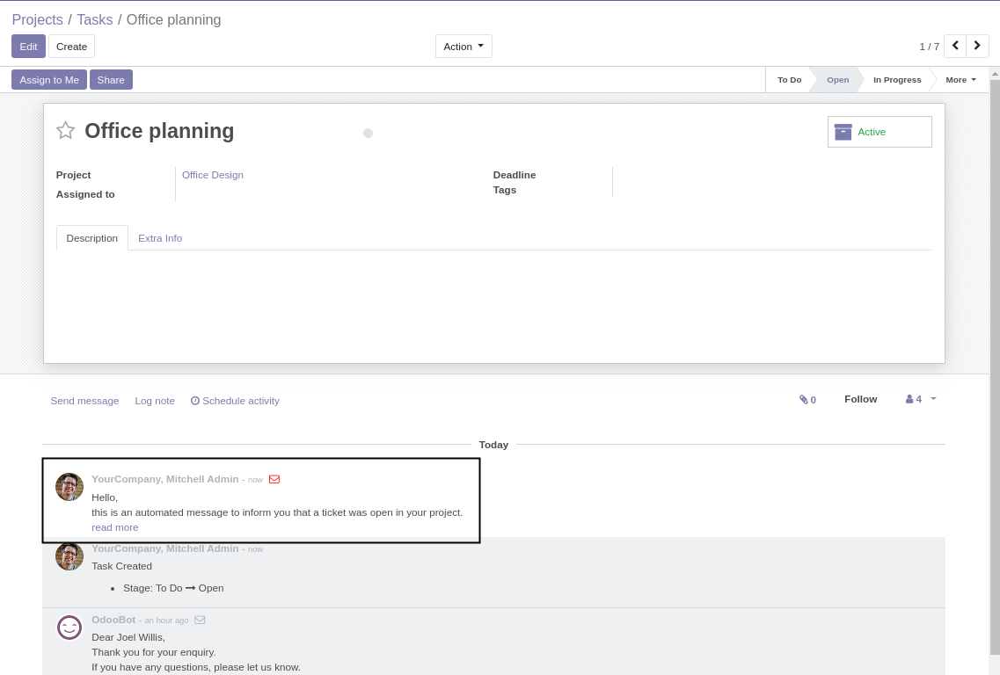

Project Task Stage External Mail
================================

.. contents:: Table of Contents

Context
-------
In Odoo, you are able to atach an email template to a task stage.

Since version 12.0, instead of publishing an email, an internal note is sent.

Use Case
--------
The main purpose of the module is to have automatic messages at the
creation of support task to be published to clients.

Usage
-----
As ``Project / Manager``, I go to the form view of a task stage.

I select an email template to be sent for this stage.

I notice a new checkbox ``External Mail``. This box is unchecked by default.

I check the box then save.

As ``Project / User``, I go to the form view of a task.

I set move the task to the stage ``Open``.

I notice that an external email was sent.

Contributors
------------
* Numigi (tm) and all its contributors (https://bit.ly/numigiens)
