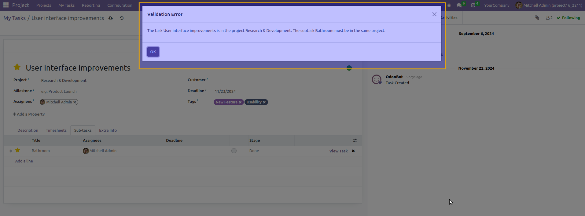
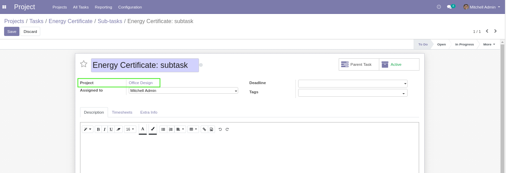

Project Task Subtask Same Project
=================================
Force the subtasks to be on the same project than its parent.

When attempting to assign a subtask to a task from a different project, 
an error message is displayed

Project Readonly on Subtask
---------------------------
On the form view of a subtask, the project is readonly.
The value is automatically propagated from the parent task.

Contributors
------------
* Numigi (tm) and all its contributors (https://bit.ly/numigiens)
