Project Template
================
This module allows to define project and task templates.

.. contents:: Table of Contents

Task Templates
--------------
As member of ``Projects / User``, I go to the form view of a task.

I notice a new checkbox ``Is Template`` under the ``Extra Info`` tab.

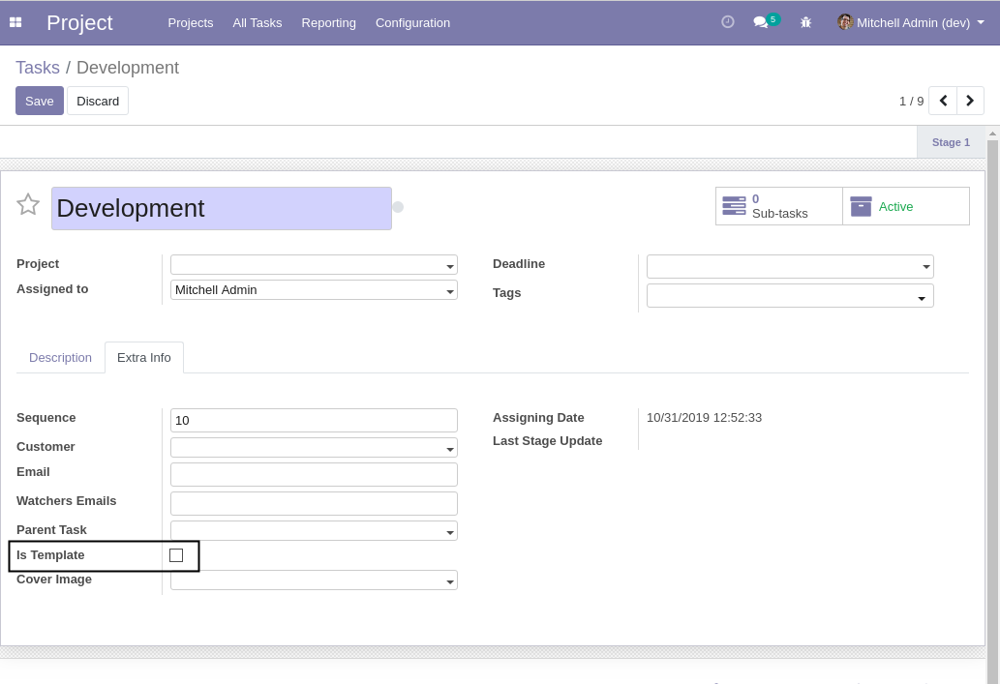

I check the box.

A warning message is displayed on the form view to signal that the task is a template.

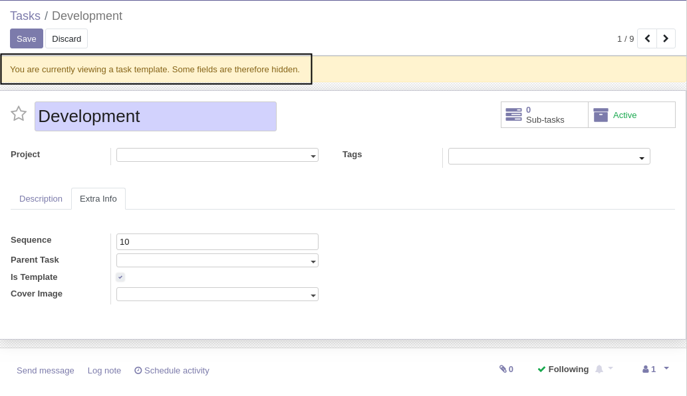

I save the template.

Hidden Fields
~~~~~~~~~~~~~
Multiple fields are hidden in the form of view of task templates including:

* Assigned To
* Customer
* Kanban State
* Date Fields
* Timesheets (see module ``project_template_timesheet``)

These fields are not relevant for a template.

Some irrelevant smart buttons are also hidden.

Search Filters
~~~~~~~~~~~~~~
By default, tasks flagged as template do not appear in search results.

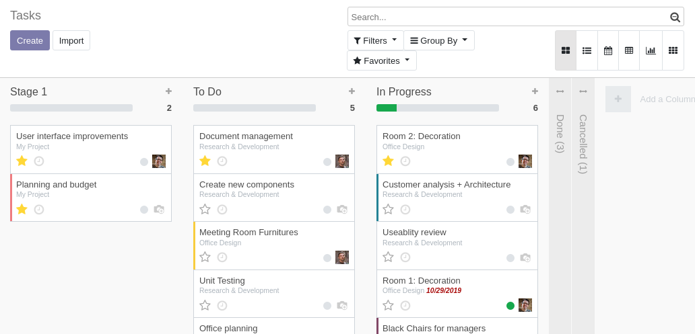

Tasks templates can be shown by activating the ``Task Templates`` filter.

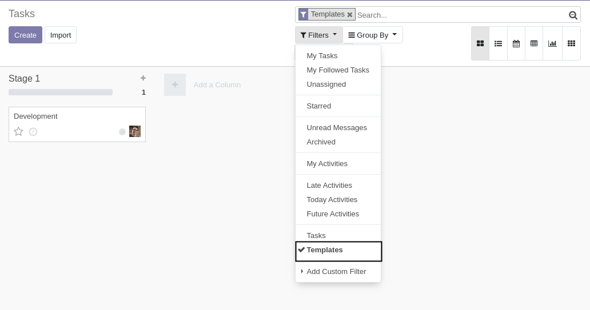

By selecting both ``Task Templates`` and ``Tasks`` filters, both templates and normal tasks are shown together.

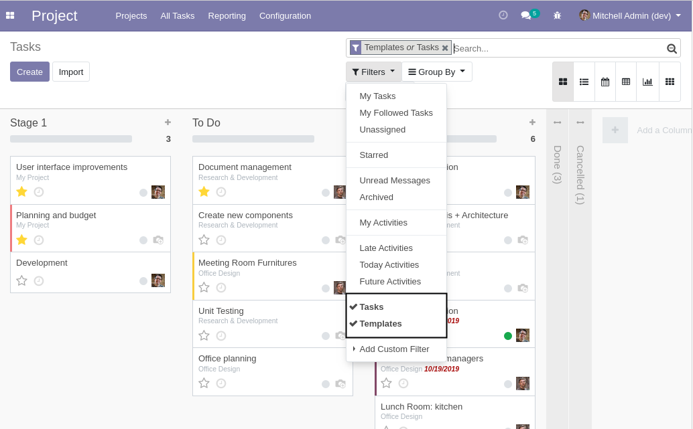

Adding Template Tasks to a Project
----------------------------------
As member of ``Projects / Manager``, I go to the form view of a project.

I notice a new button ``Add Task Templates``.

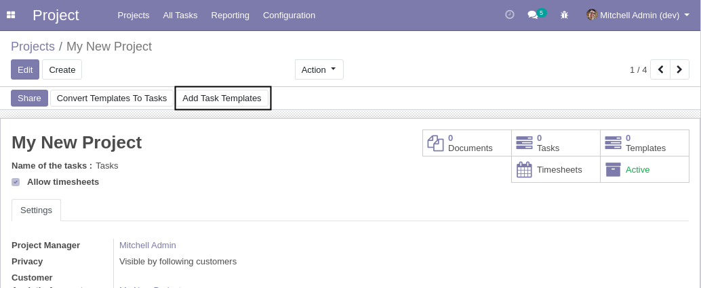

I click on the button. A wizard is opened.

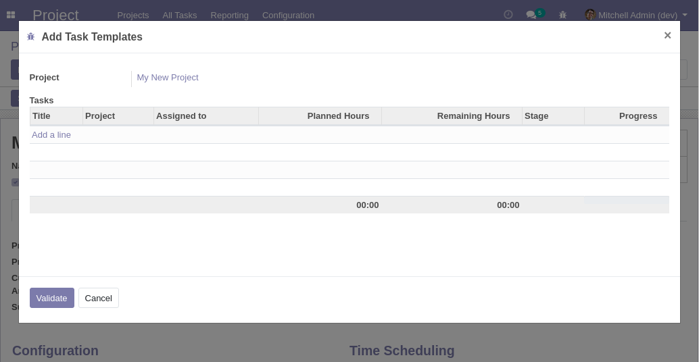

The wizard allows to select one or multiple task templates.

I select my task template and validate.

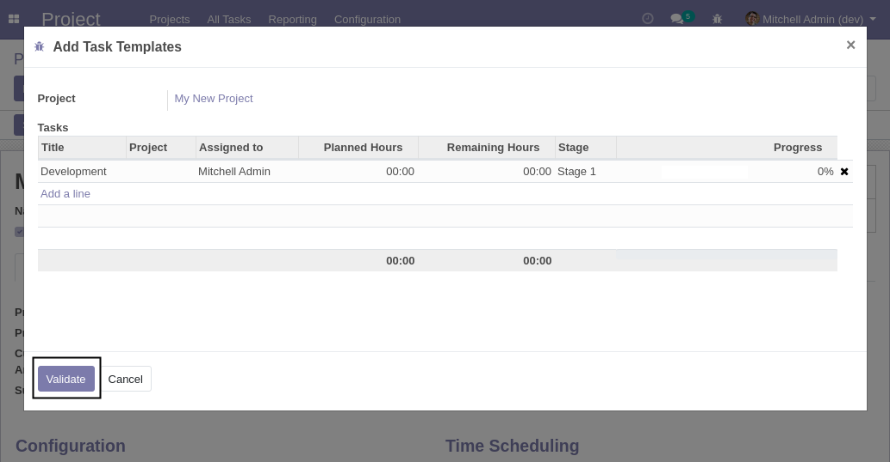

Back on my project, I notice that I have one task template.

.. image:: static/description/project_task_template_smart_button.png

If I click on the button, I see the list view of templates under my project.

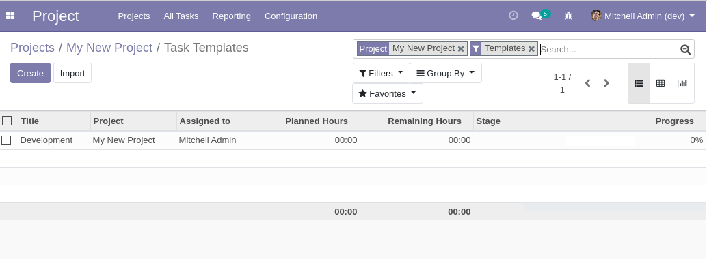

How This Works
~~~~~~~~~~~~~~
Behind the scene, each selected task template is copied to create a new task template under the project.

Therefore, after adding the template to the project, you may customize the template for your project,
without impacting the ``master / main`` template.

Converting Templates To Tasks
-----------------------------
Back to my project, I notice a button ``Convert Templates To Tasks``.

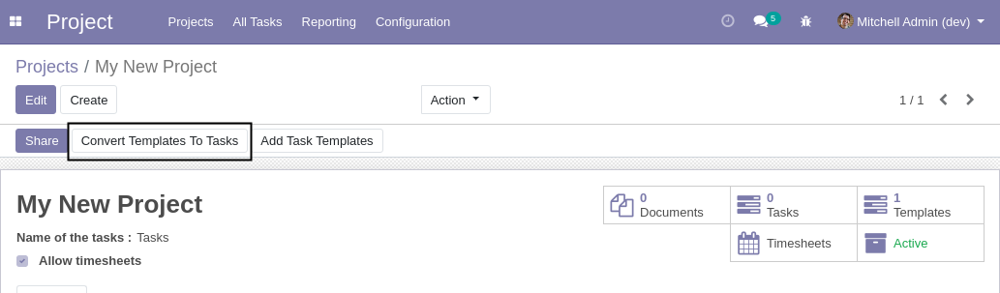

After clicking on the button, I notice that I have one task.

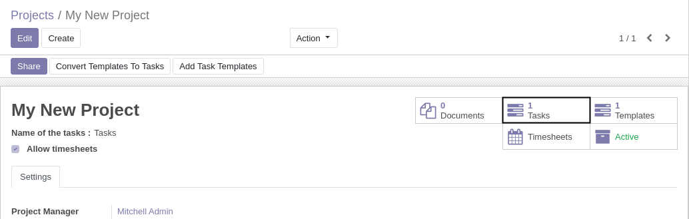

The ``Convert Templates To Tasks`` button has a clever mecanism.

Behind the scene, each task template under the project is copied to create a real task.

Idempotent
~~~~~~~~~~
If a template was already converted into a task, it will not be converted again.

Subtasks
~~~~~~~~
A template task may have subtasks (which must be templates as well).

In such case, each subtask inside the template task is also copied to create a real subtask.

If after clicking on the button, a new ``subtemplate`` is added to a template task,
clicking a second time on the button will generate a real subtask.

Task / Subtasks Integrity
-------------------------
If a task is a template, then its subtasks must be templates as well.
If a task is not a template, then its subtasks must not be templates.

When creating a subtask, the ``Is Template`` box is automatically propagated.

If a task is set as template, all its subtasks are automatically set as template.

Pivot Tables
------------
In the pivot table of a task, a new field ``Template / Task`` allows to partition the table between templates and real tasks.

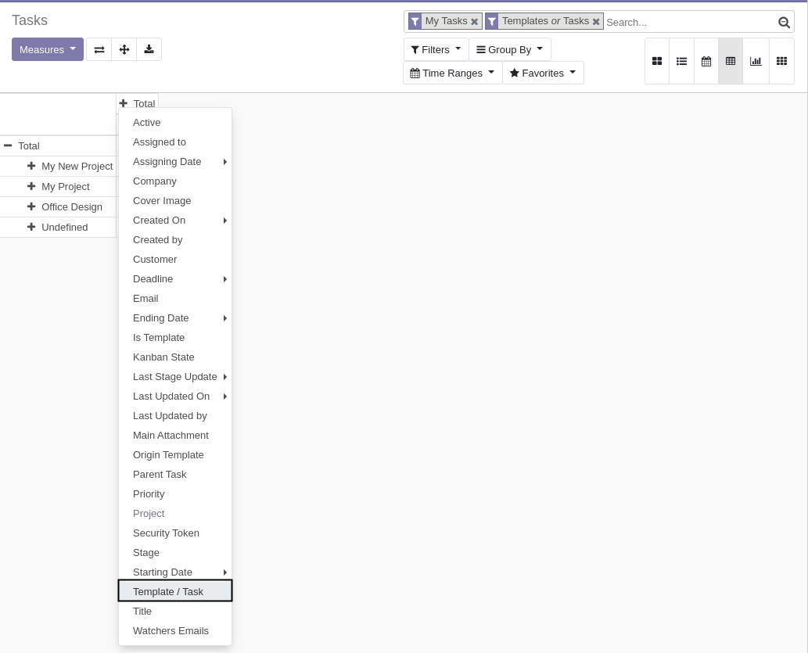

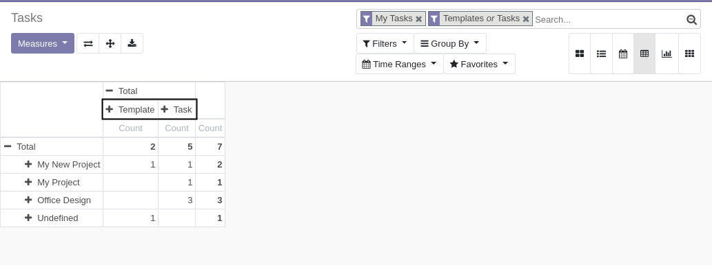

This can be usefull to compare:

* Planned Hours on Templates (budgeted hours)
* Planned Hours on Tasks
* Spent Hours on Tasks

Known Issues
------------
For now project templates are not implemented. This will be implemented in this module.

Integration with timesheets will also be implemented in a separate module (`project_template_timesheet`).

Contributors
------------
* Numigi (tm) and all its contributors (https://bit.ly/numigiens)
