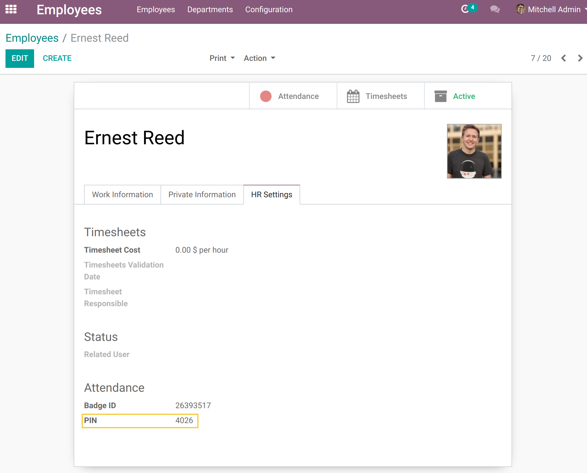
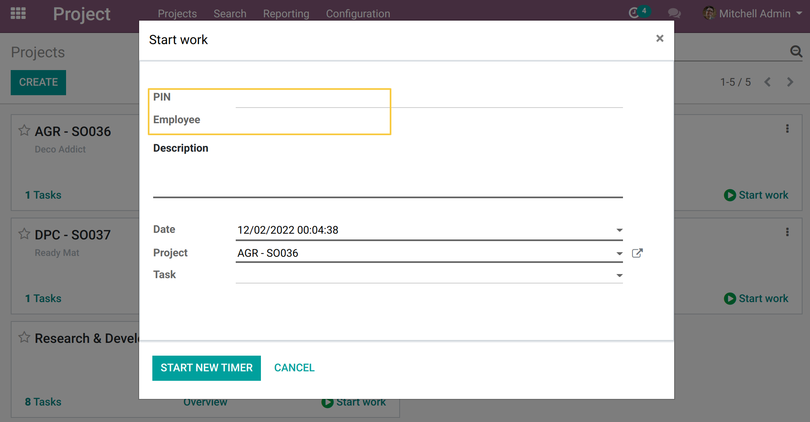
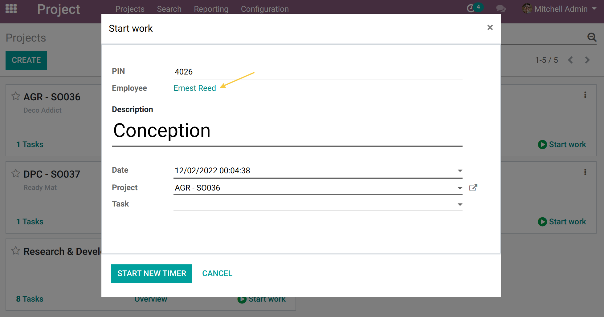
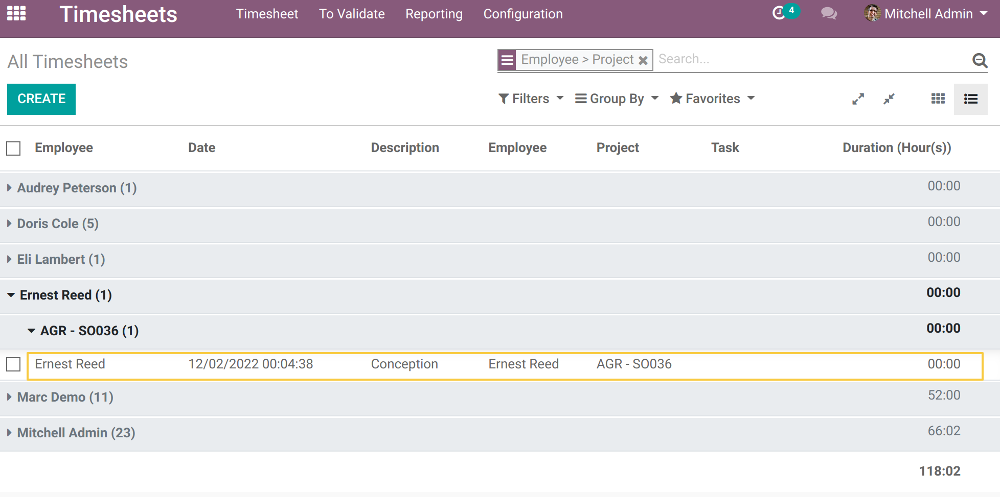

Project Timesheet Time Control Employee PIN
-------------------------------------------

Overview
--------
This module allows you to create timesheets for an employee different from the
one linked to its user from the timer added by
`project_timesheet_time_control <https://github.com/OCA/project/tree/12.0/project_timesheet_time_control>`_ module

Usage
-----
As a user belonging to the `Attendance / Manager` group, I go to the form view of an Employee.
Under the HR Settings tab, I fill in the Code (PIN) field and I save.

If the field `PIN` doesn't appear in the form view,
make sure you have the right `Enable PIN use` checked.

As an employee with access `Timesheet / Manager`, I go to a project or a task and click on `Start work`.
I see that the following two fields are present:

If I insert the PIN, the employee will be automatically added.

As a `Timesheets / Manager` user, I go to the `Timesheets application > All timesheets`.
I see that the timesheet line is created and that it is associated
with the employee chosen by NIP.

I return to another project to start new work timer for the same employee,
I notice that the message about the current timer is displayed and the `Start new timer` button is replaced by the `Stop the previous timer and start the new` button.

.. image:: static/description/stop_running_timer_to_start_new_one.png

As a `Timesheets / Manager` user, I go again to the `Timesheets application > All timesheets`.
I see that a new timesheet line is created for the employee.

Contributors
------------
* Numigi (tm) and all its contributors (https://bit.ly/numigiens)
