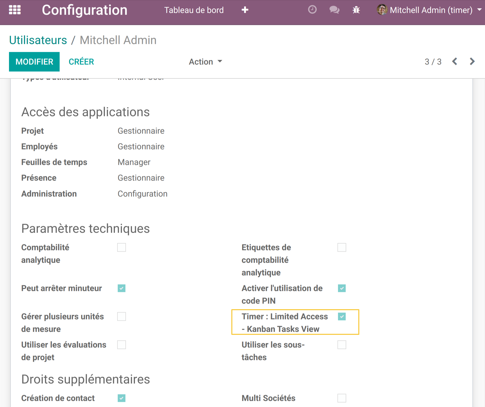
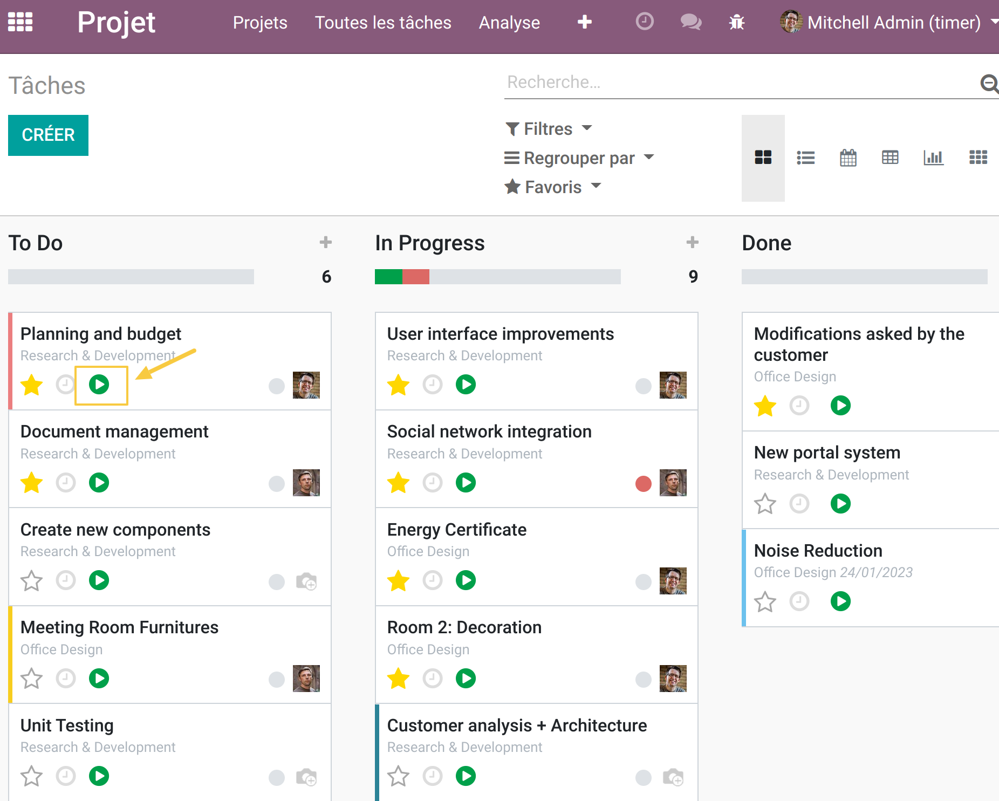
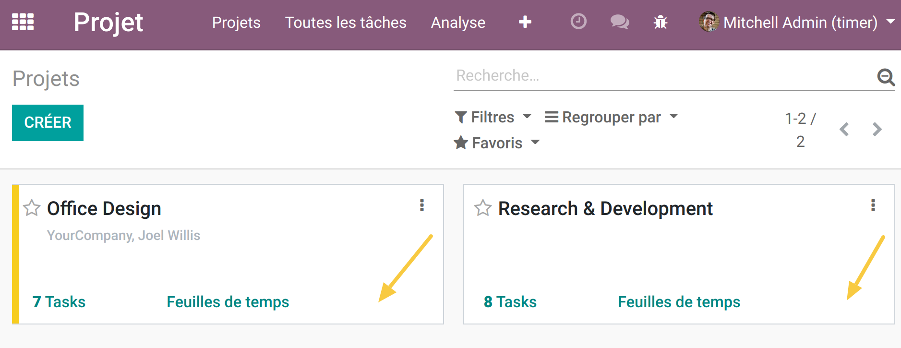
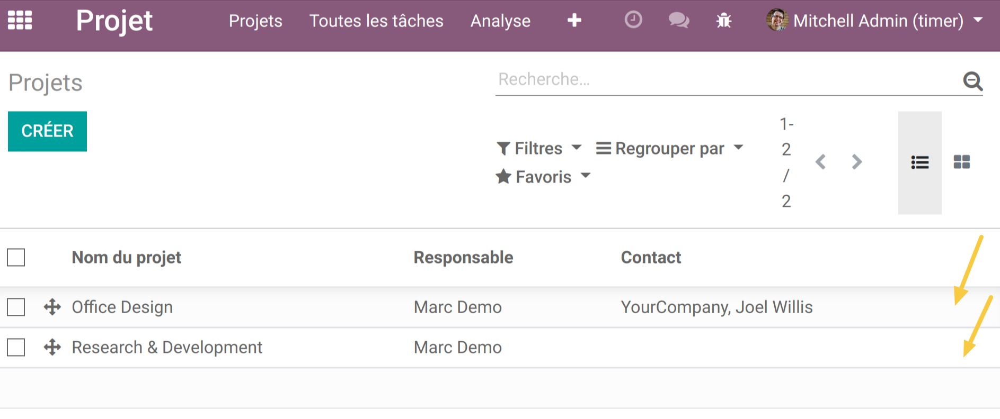
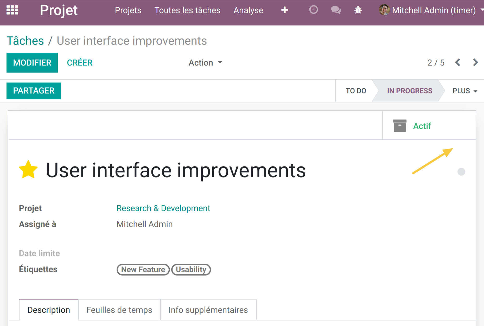
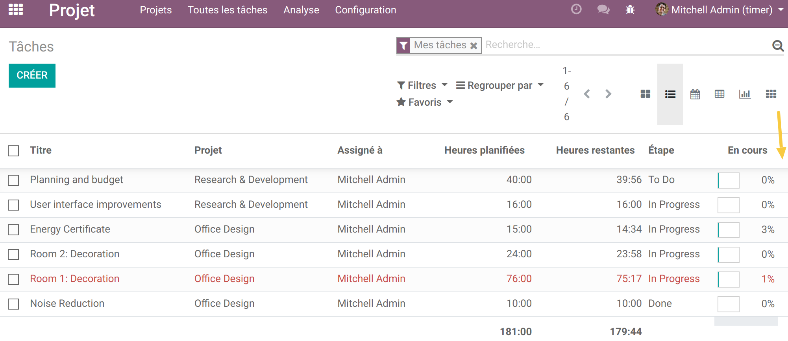
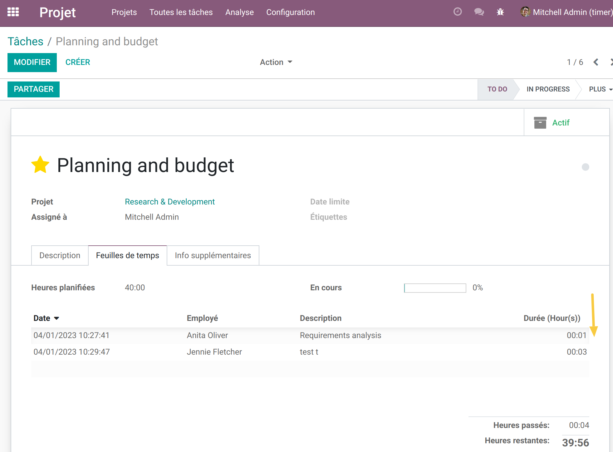

Project Timesheet Time Control Employee PIN
-------------------------------------------

Overview
--------
This module adds group to limit access to launch the timer except from Task Kanban View

The module depends of `project_timesheet_time_control <https://github.com/OCA/project/tree/12.0/project_timesheet_time_control>`_ module

Configuration
-------------

As a user who can manage user rights, I go to the form view of a user.
I see that a new group of rights `Timer: Limited access - task kanban view` is present.
I check the box and save the changes.

Usage
-----

As a user with group `Timer: Limited access - task kanban view`, I go to the Projects application.
I see that the timer launch button icon is only available from the `Task Kanban` view.

The timer is no longer displayed on the kanban and list views of `Projects`.

The timer is no longer displayed on the form and list views of `Tasks`.

The timer is no longer displayed on the list view of `Timesheets` from a task.

Contributors
------------
* Numigi (tm) and all its contributors (https://bit.ly/numigiens)

More information
----------------
* Meet us at https://bit.ly/numigi-com
