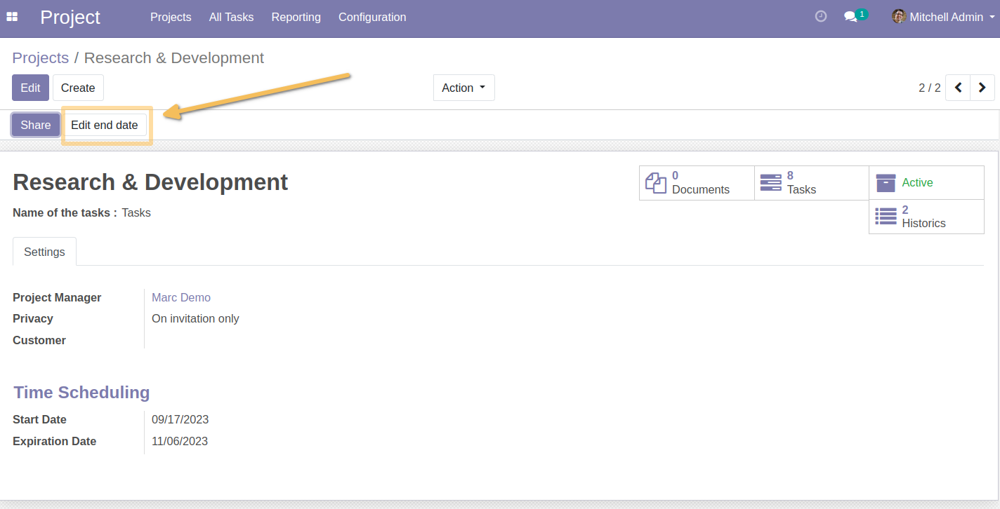
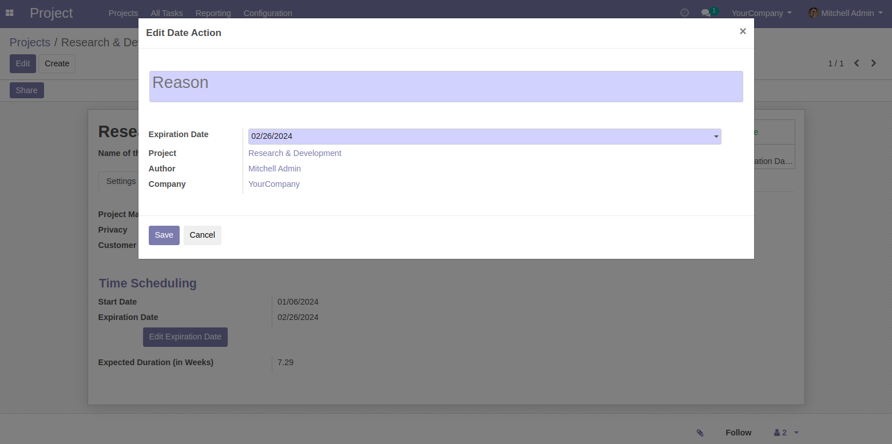
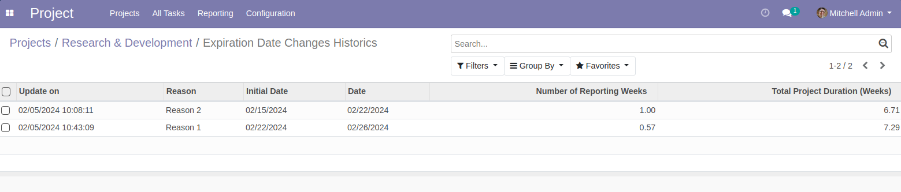

Project Track End Date
======================
This module gives the possibility to trace the changes in the end of validity date of each project/lot.

Usage
-----
Changing the expiry date must be done by clicking on the Change date button:

The `Edit End Date` button will only be visible if the project status is different from Project / Completed and Abandoned (test only in french: `Terminé`, `Abandonné`).
You can update the end date field only if the project status is equal to planned (test only in french: `Prévu`)
The expiry date field must be locked and is only modified using the modification button. Manual modification will not be possible.

A popup wizard will open :

This modification is listed among others in the following list.
The list is accessible from the smart button:

.. image:: static/description/project_end_date_historics.png

Contributors
------------
* Numigi (tm) and all its contributors (https://bit.ly/numigiens)
