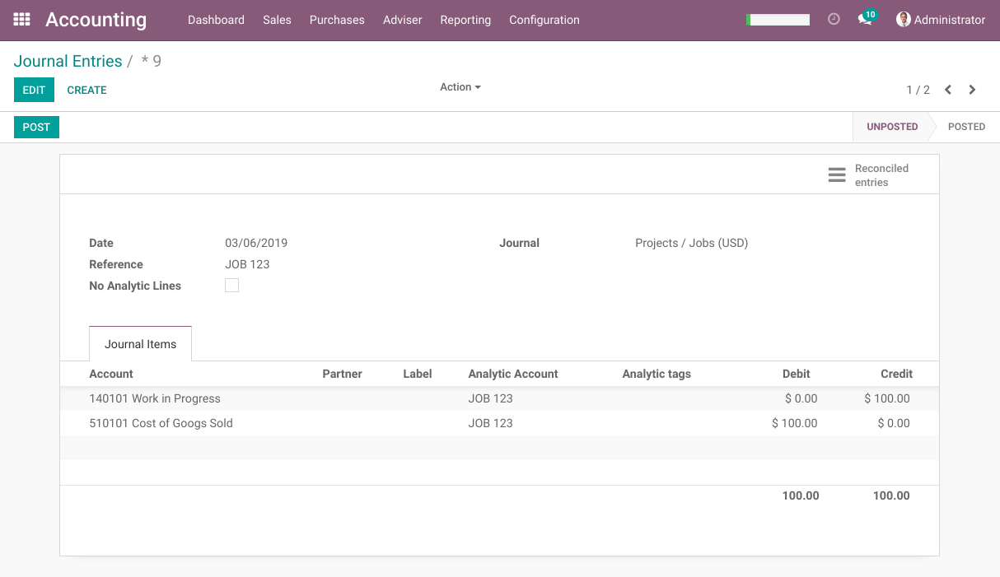
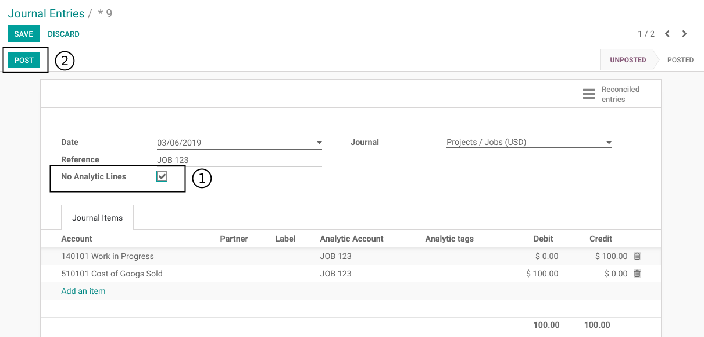
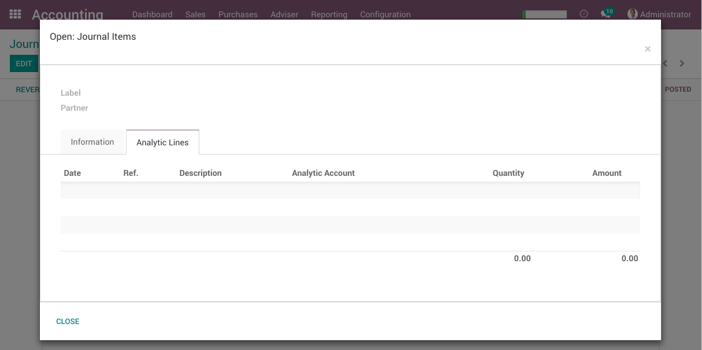
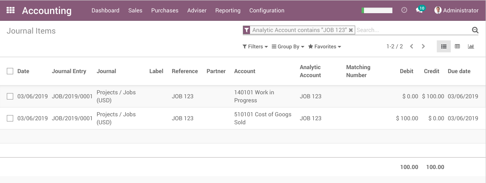

Project Work In Progress
========================
This module enables to manage `Work In Progress` (WIP) accounting.

Work In Progress
----------------
`Work In Progress` is an account of the general ledger.

It includes consumed products, direct labour costs and factory overhead costs
related to an unfinished manufacturing project.

Once a project is delivered, the costs associated to this project are transfered
to the `Cost of Finished Goods` (CFG) or to the `Cost of Goods Sold` (CGS).

Cost of Finished Goods
----------------------
`Cost of Finished Goods` (CFG) is a step between WIP and CGS.

It represents finished products that are still in inventory.
Not all companies maintain a CFG account, depending on their business requirements.

The current module does not implement CFG.
The costs of a project are transfered directly to the CGS when the project is finished.

How The Module Works
--------------------
The module uses analytic accounts to dispatch WIP accounting entries per project.

An action on the project allows to transfer all WIP entries into CGS.

Each WIP entry is reconciled with its related CGS entry.
New WIP entries can be identified easily and transfered into CGS.

Anlytic Entries
---------------
When transfering WIP into CFG, you get the following account move:

At this point, creating 2 analytic entries for this move would only pollute the database.
One analytic entry would cancel the other.

A mecanism is added by the module to prevent creating analytic entries for an account move.

To use this feature, the field `No Analytic Lines` can be checked before posting the account move.

The analytic account field is still used to filter the general ledger by project/job.

Contributors
------------
* Numigi (tm) and all its contributors (https://bit.ly/numigiens)
