Project Work In Progress
========================
This module enables to manage `Work In Progress` (WIP) accounting.

Work In Progress
----------------
`Work In Progress` is an account of the general ledger.

It includes consumed products, direct labour costs and factory overhead costs
related to an unfinished manufacturing project.

Once a project is delivered, the costs associated to this project are transfered
to the `Cost of Finished Goods` (CFG) or to the `Cost of Goods Sold` (CGS).

Cost of Finished Goods
----------------------
`Cost of Finished Goods` (CFG) is a step between WIP and CGS.

It represents finished products that are still in inventory.
Not all companies maintain a CFG account, depending on their business requirements.

The current module does not implement CFG.
The costs of a project are transfered directly to the CGS when the project is finished.

How The Module Works
--------------------
The module uses analytic accounts to dispatch WIP accounting entries per project.

An action on the project allows to transfer all WIP entries into CGS.

Each WIP entry is reconciled with its related CGS entry.
New WIP entries can be identified easily and transfered into CGS.

Anlytic Entries
---------------
When transfering WIP into CFG, you get the following account move:

.. image:: static/description/account_move_wip_to_cgs.png

At this point, creating 2 analytic entries for this move would only pollute the database.
One analytic entry would cancel the other.

A mecanism is added by the module to prevent creating analytic entries for an account move.

To use this feature, the field `No Analytic Lines` can be checked before posting the account move.

.. image:: static/description/account_move_no_analytic_lines.png

.. image:: static/description/account_move_line_form_with_no_analytic_lines.png

The analytic account field is still used to filter the general ledger by project/job.

.. image:: static/description/general_ledger_filtered_by_analytic_lines.png

Transfering WIP To CGS
----------------------
As member of the group `Project / Manager`, I go to `Project / Configuration / Projects`, then I select my project.

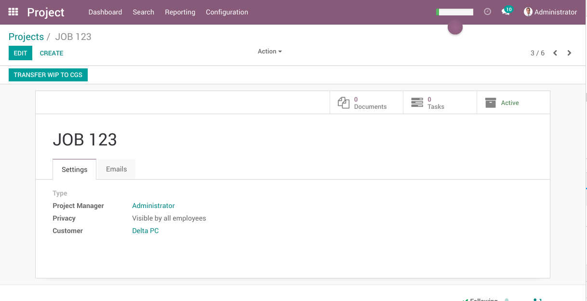

In the field `Type`, I click on `Create and Edit`.

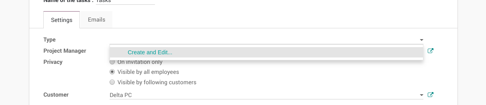

I create a new `Project Type` named `Manufacturing`.

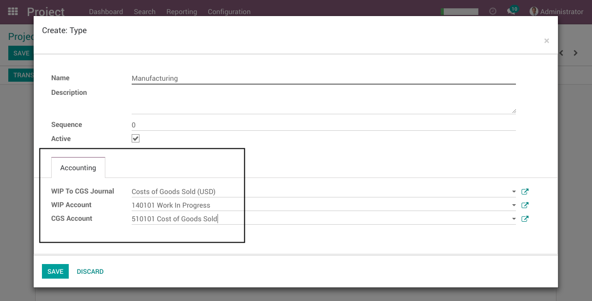

In the `Accounting` tab, I fill the following fields:

* WIP To CGS Journal: This journal will be used when transfering WIP journal items into CGS.
* WIP Account: This account will be used to cumulate Work In Progress.
* CGS Account: This account will be used to cumulate Costs of Goods Sold.

Back to the project form, I click on `Save`.

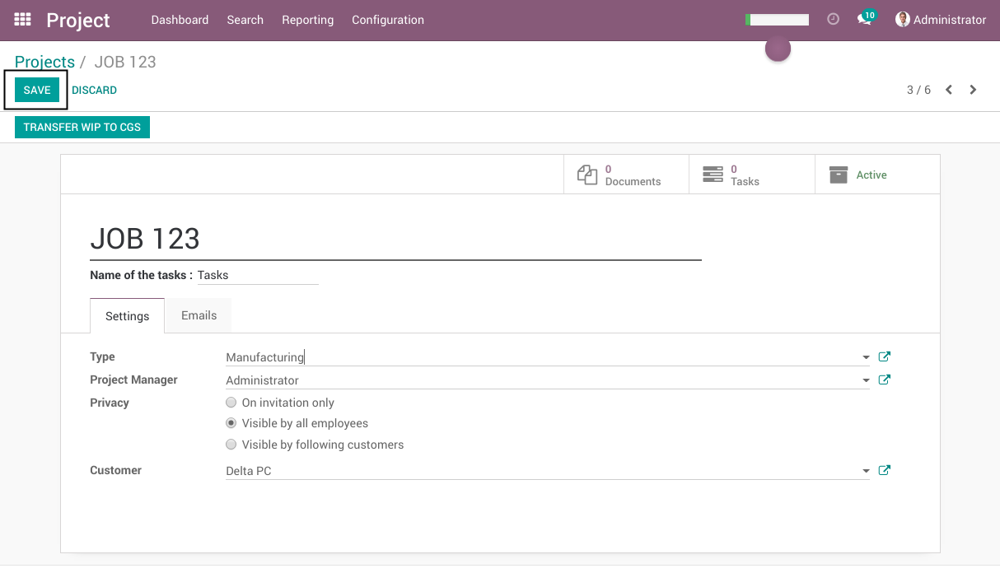

Now, In the `Accounting` application, we are going to post three accounting entries.

One entry for raw materials.

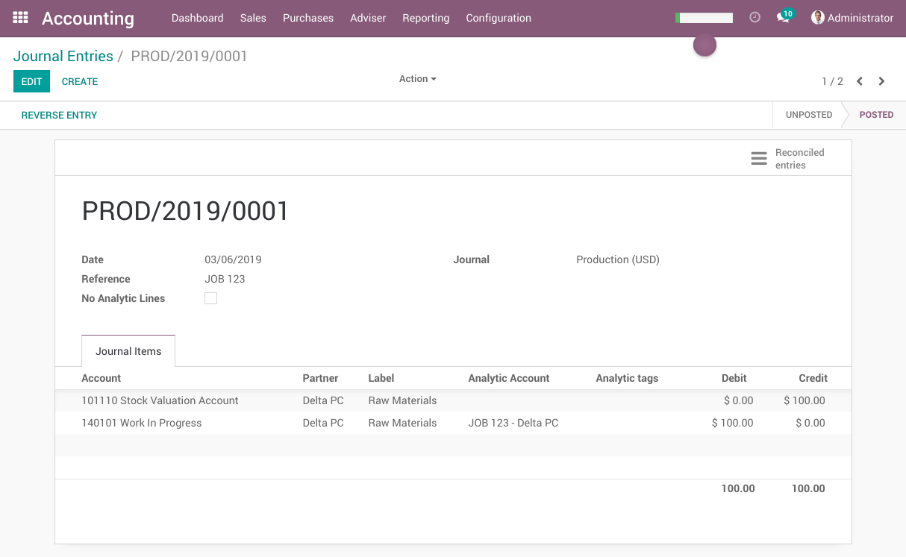

One entry for direct labour.

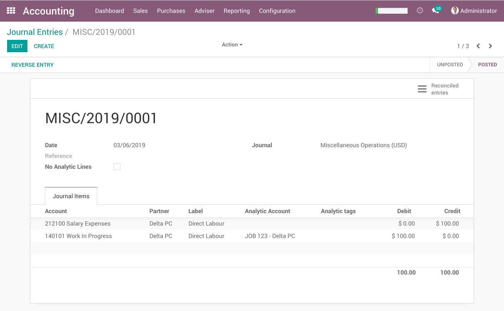

One entry for outsourcing.

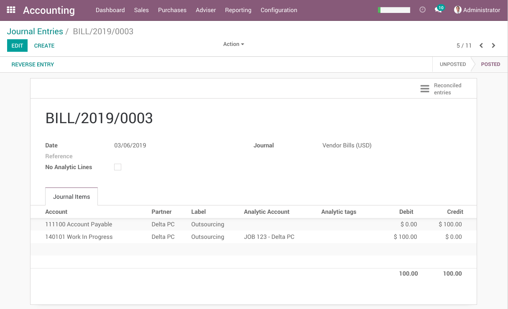

In the general ledger, I filter for the WIP account. The balance of the account is $ 300.00.

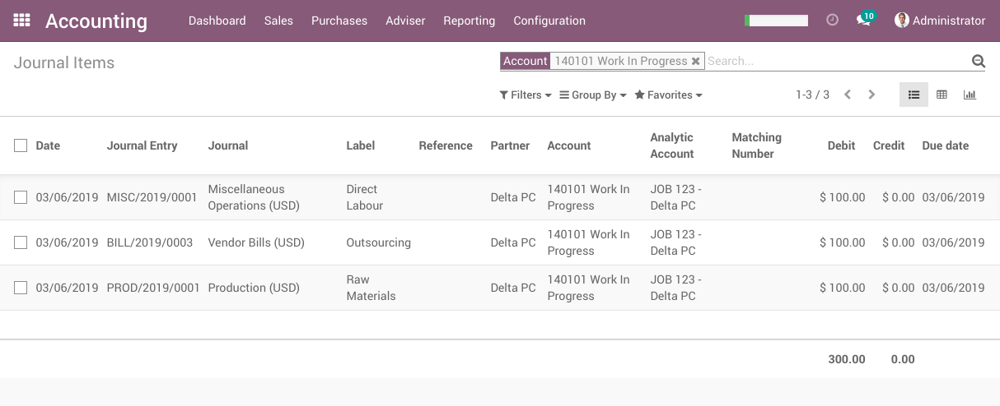

Back to the form view of my project, I click on `Transfer WIP To CGS`.

.. image:: static/description/project_wip_to_cgs_button.png

A wizard is appears.

It allows me to select a specific accounting date for the transfer.
By default, the current date is selected.

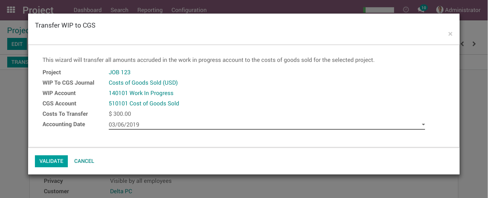

I click on `Validate`.

Back to the general ledger, I notice that the balance of the WIP account is null.

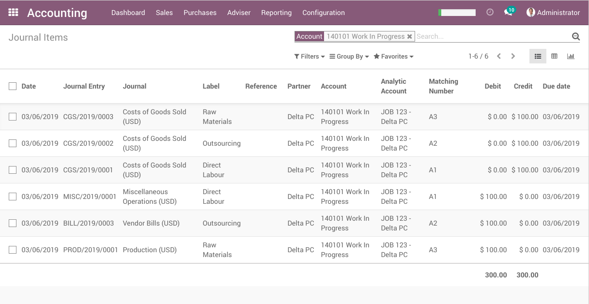

Every debit in the WIP account is reconciled with its related credit.

In the `Cost of Goods Sold` account, I notice 3 journal items.

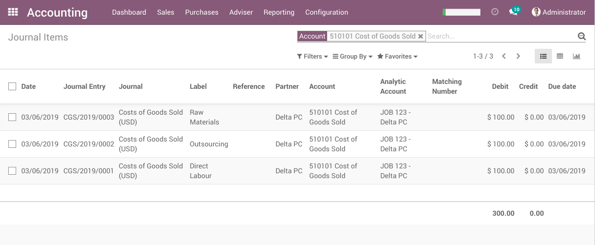

Repeating the Operation
-----------------------
The operation can be repeated multiple times. Each time, only the new WIP entries will be transfered to CGS.

If I go back to the project form and click on the button. The wizard will show $ 0.00 to transfer.

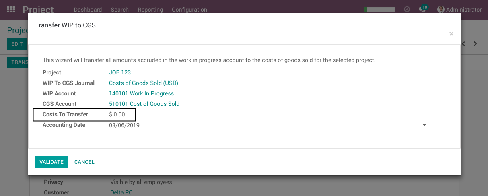

Analytic Entries
----------------
I go to `Accounting / Adviser / Analytic Entries`.

I see 3 analytic entries. These are the analytic entries of my initial WIP journal entries.

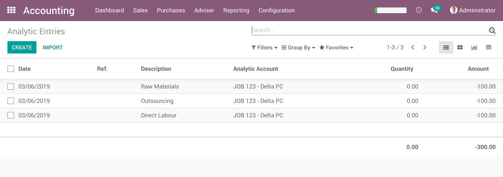

The transfers from WIP to CGS did not create extra analytic entries.

Contributors
------------
* Numigi (tm) and all its contributors (https://bit.ly/numigiens)
