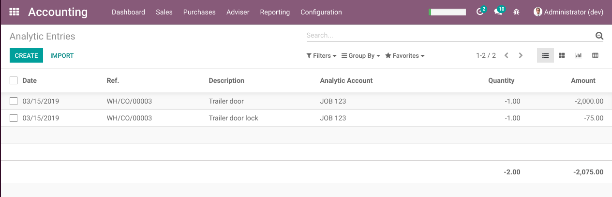

Project WIP Batch Closing
=========================
Modules for managing work-in-progress (WIP), project management, and integration with inventory are
used to handle operations related to dismantling, design, and manufacturing.
When items are consumed to integrate them into deliverable products, accounting entries are automatically
generated by the system to allocate or transfer the stock cost from the “Stock Valuation Account”
to the “Work-in-Progress (WIP) Account” as an asset.

At the end of each month—or at any desired time—a WIP Closing Assistant can be used from the project module
to reverse the WIP assets (the “Work-in-Progress (WIP) Account”) and recognize the Cost of Goods Sold (COGS) expense.

Usage
-----
As a Project user with access to the “Transfer WIP to COGS” feature, it is necessary to:
● Post WIP charges for all ongoing projects
● Define a cut-off date (i.e. a specific closing date for the operations) that is separate from today’s date for the WIP transfer.

Contributors
------------
* Numigi (tm) and all its contributors (https://bit.ly/numigiens)
