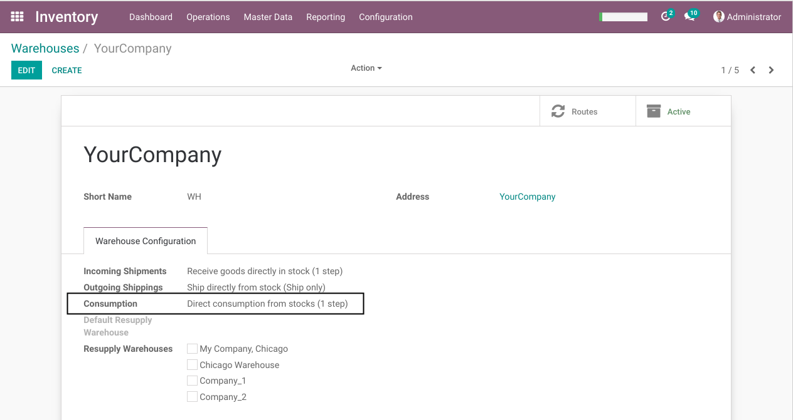
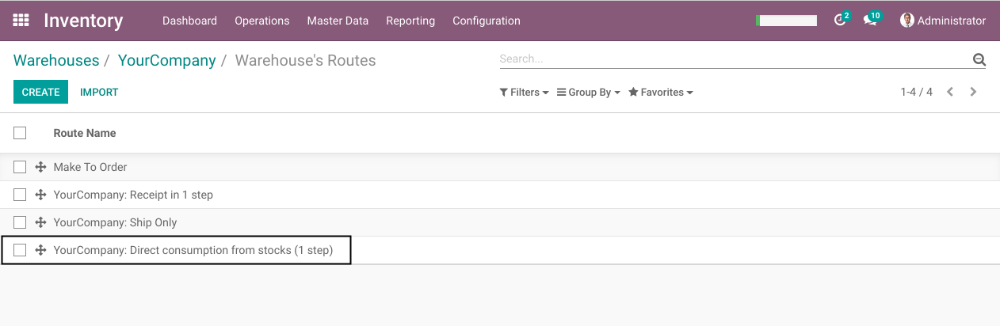
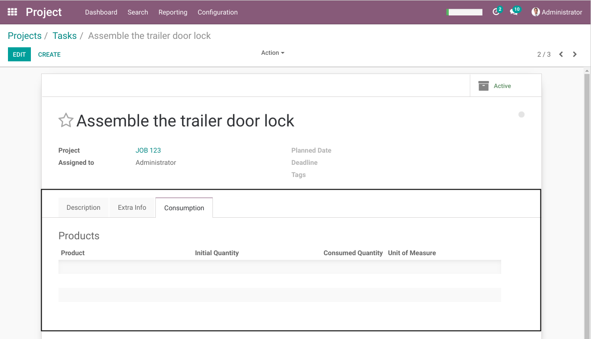
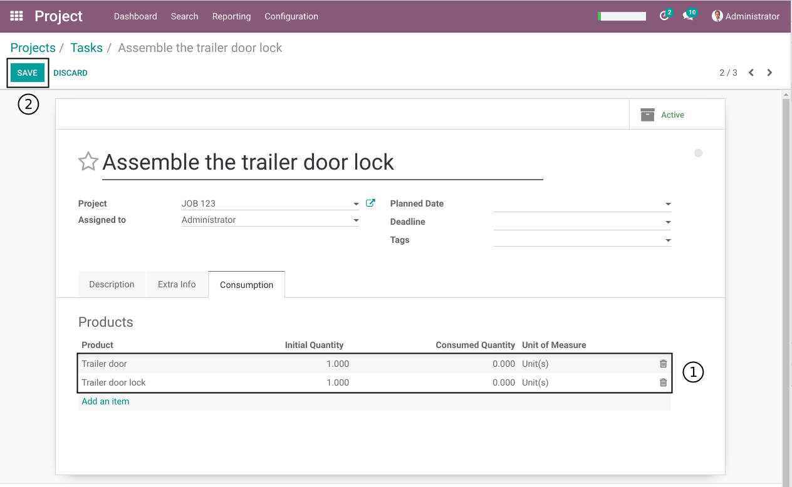
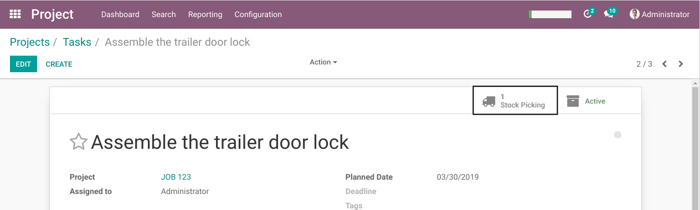
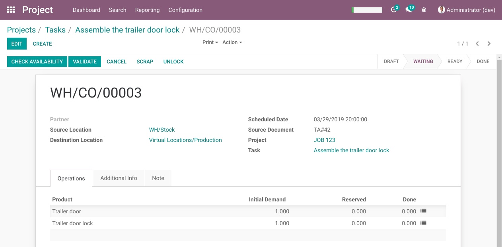
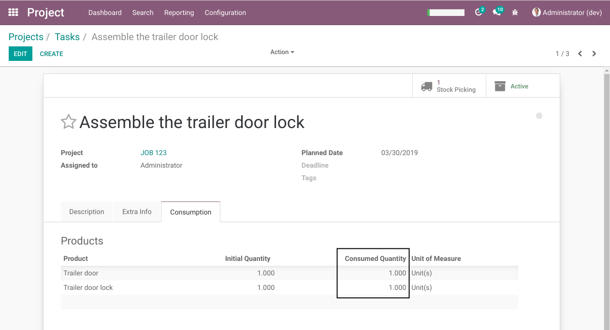

Project WIP Material
====================
This module extends the project_wip (Project Work in Progress) module.

It enables to consume material (products) on a task.

The consumed product costs are accruded in the WIP account.

Warehouse Configuration
-----------------------
As member of the group `Stock / Manager`, I go to the form view of my warehouse.

In the `Warehouse Configuration` tab, I see a field `Consumption`.

I let the default option `Direct Consumption From Stocks (1 step)`.

One route is created automatically by the system for the material consumption.

Task Material
-------------
As member of the group `Project / User`, I go to the form view of a task.

I see a `Material` containing a table of products to consume for this task.

I can only select stockable or consumable products.

I add the products required for the task, then I click on `Save`.

Because I did not fill the field `Planned Date`, the following error message appears.

.. image:: static/description/task_planned_date_error_message.png

I fill the `Planned Date` field, then I click on `Save`.

.. image:: static/description/task_with_planned_date.png

After saving, a new smart button `Stock Pickings` appears.

Consumption Stock Picking
-------------------------
After clicking on the button, I see the form view of a stock picking.

1- The project and task were propagated to the picking.
2- The planned date from the task was propagatted to the scheduled date of the picking.

I validate the stock picking.

.. image:: static/description/stock_picking_form_done.png

Back to the task, I notice that the consumed quantities were updated.

Journal Items
-------------
In the general ledger, I filter the journal items to see only items related to my project:

.. image:: static/description/general_ledger_analytic_filter.png

I notice that 2 debit entries were posted in the `Work in Progress` account, one for each product consumed.

In the analytic lines list, I also find 2 entries for the consumed products.

.. image:: static/description/analytic_line_list.png

Contributors
------------
* Numigi (tm) and all its contributors (https://bit.ly/numigiens)
