Project WIP Material
====================
This module extends the project_wip (Project Work in Progress) module.

It enables to consume material (products) on a task.

The consumed product costs are accruded in the WIP account.

.. contents:: Table of Contents

Warehouse Configuration
-----------------------
As member of the group ``Stock / Manager``, I go to the form view of my warehouse.

In the ``Warehouse Configuration`` tab, I see a field ``Consumption``.

.. image:: static/description/warehouse_form.png

I let the default option ``Direct Consumption From Stocks (1 step)``.

One route is created automatically by the system for the material consumption.

.. image:: static/description/consumption_route.png

Task Material
-------------
As member of the group ``Project / User``, I go to the form view of a task.

I see a ``Material`` containing a table of products to consume for this task.

.. image:: static/description/task_material_tab.png

I can only select stockable or consumable products.

I add the products required for the task, then I click on ``Save``.

.. image:: static/description/task_material_tab_with_products.png

Because I did not fill the field ``Planned Date``, the following error message appears.

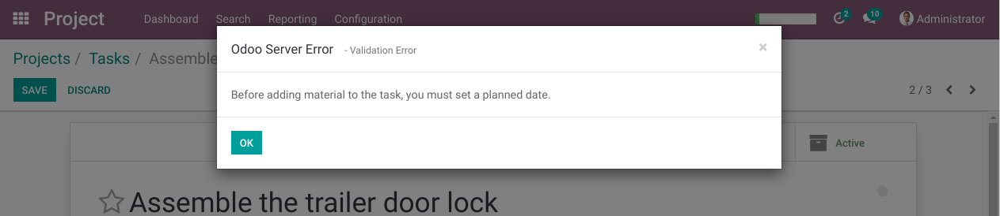

I fill the ``Planned Date`` field, then I click on ``Save``.

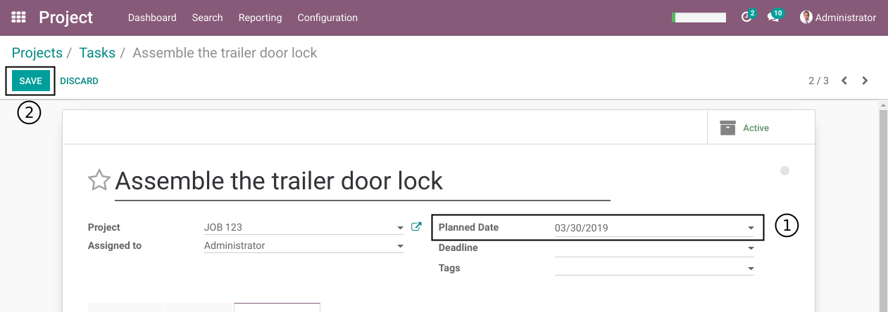

After saving, a new smart button ``Stock Pickings`` appears.

.. image:: static/description/task_stock_picking_smart_button.png

Consumption Stock Picking
-------------------------
After clicking on the button, I see the form view of a stock picking.

.. image:: static/description/stock_picking_form.png

* The project and task were propagated to the picking.
* The planned date from the task was propagatted to the scheduled date of the picking.

I validate the stock picking.

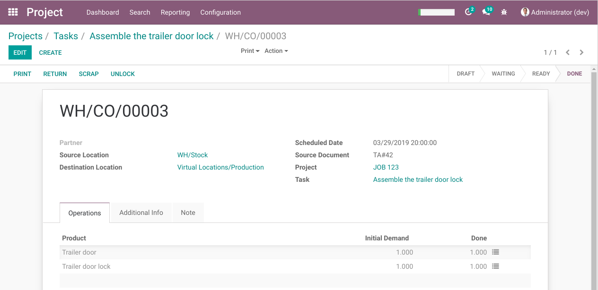

Back to the task, I notice that the consumed quantities were updated.

.. image:: static/description/task_with_consumed_qty.png

Journal Items
-------------
In the general ledger, I filter the journal items to see only items related to my project:

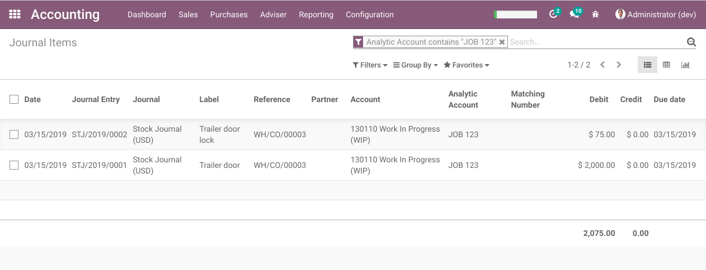

I notice that 2 debit entries were posted in the ``Work in Progress`` account, one for each product consumed.

In the analytic lines list, I also find 2 entries for the consumed products.

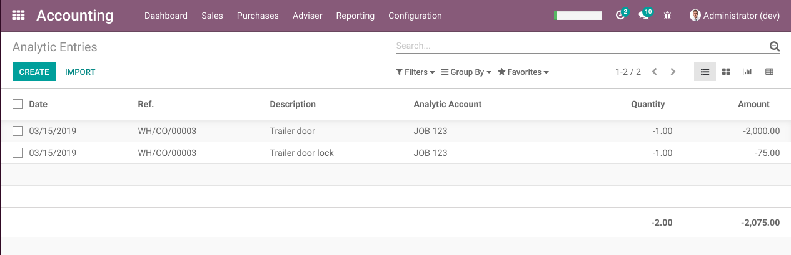

Preparation Step
----------------
Since version ``1.1.0`` of the module, a ``Preparation`` step is introduced to the ``Consumption`` route.

To use this step, as ``Inventory / Manager``, I go to the form view of a warehouse.

I notice a new option ``Prepare the stock before consumption (2 steps)``.

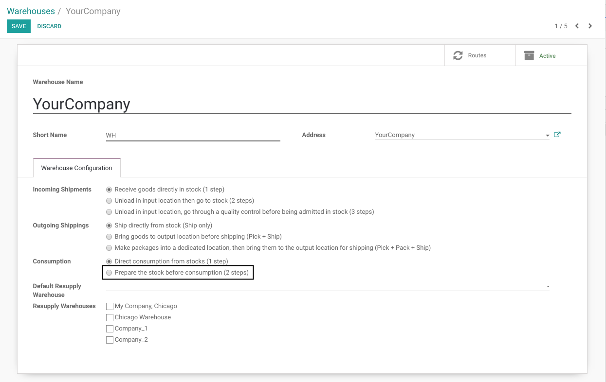

I select this option.

A new field ``Preparation Location`` appears.

..

    When selecting the 2 steps options, the preparation location is mandatory.

    However, if the warehouse was never created, no location exist for this warehouse.
    Therefore, the warehouse must be created (saved) before selecting the 2 steps option.

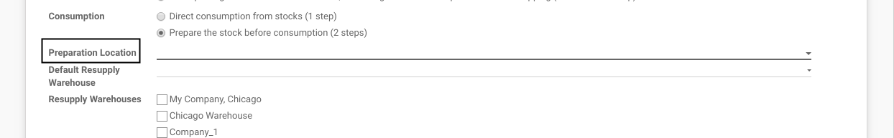

I create a new location for preparations.

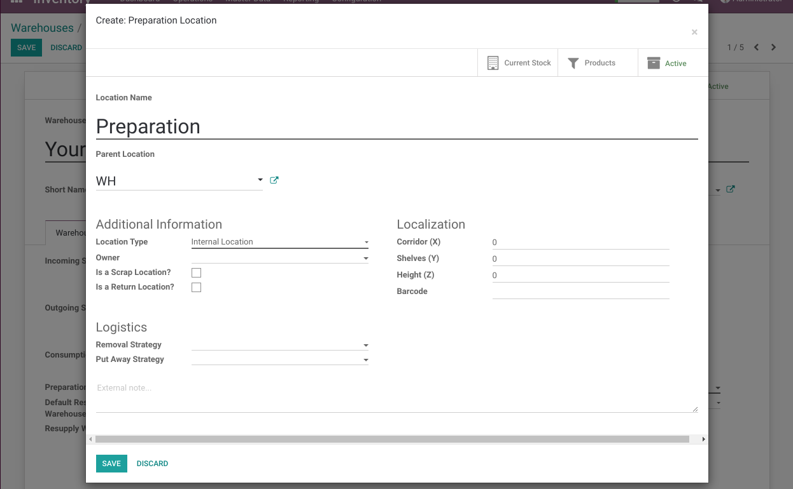

..

    The parent location must be another location under the warehouse.
    The location type must be ``Internal Location``.

Optionaly, you may select an existing stock location of your warehouse.

Preparation Types
~~~~~~~~~~~~~~~~~
When selecting the preparation step, 2 new types of operations are added to the warehouse:

* Preparations
* Preparation Returns

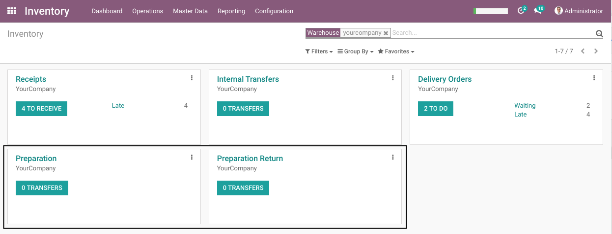

Task Material
~~~~~~~~~~~~~
When adding new material lines to a task, 2 pickings are generated:

(1) The preparation picking
(2) The consumption picking

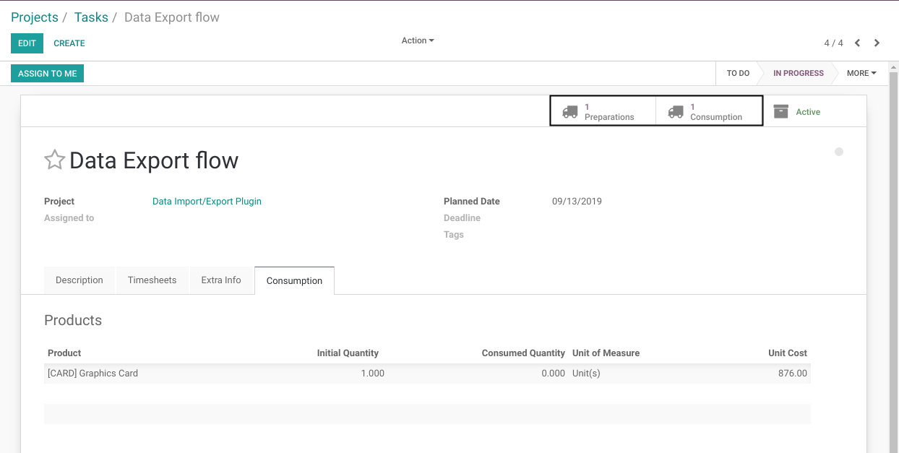

By clicking on ``Preparations``, I am redirected to the form view of the preparation picking.

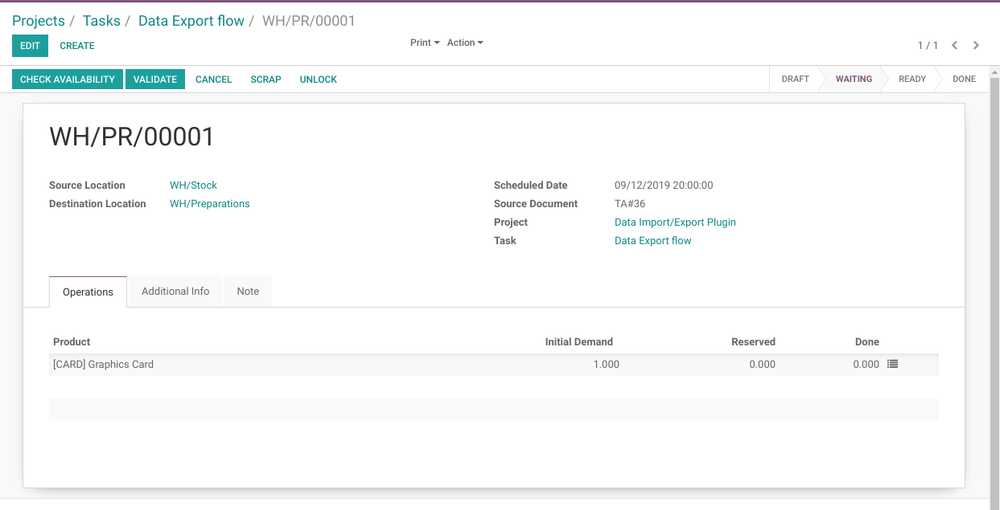

If products are returned from the preparation step, a new smart button is added to show the ``Preparation Return Picking``:

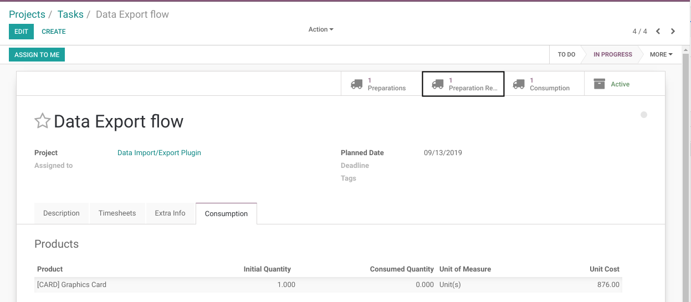

By clicking on ``Preparation Returns``, I am redirected to the form view of the return picking.

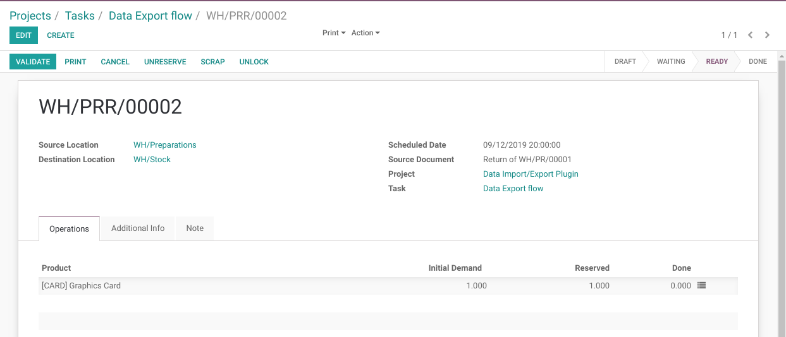

Material List View
------------------
Since version ``1.2.0`` of the module, a new list view of all task material is available.

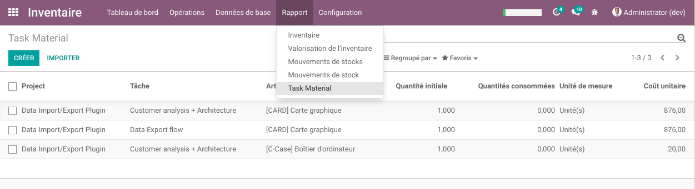

This list is available from both ``Inventory / Report`` and ``Project / Report`` menus.

It allows to add new material lines or modify the initial quantity on existing lines.

Deleting a Line
~~~~~~~~~~~~~~~
Deleting a Line is possible by selecting one or multiple lines and ``Action / Delete``.

Changing the Task
~~~~~~~~~~~~~~~~~
The project, task and product on an existing line are modifiable.

If one of those fields is changed, the line quantity will reset to 0.

On the list view, the same constraints are applied than with modifications on the task.

Project Smart Button
~~~~~~~~~~~~~~~~~~~~
From the form view of a project, a smart button allows to access the material related to this project.

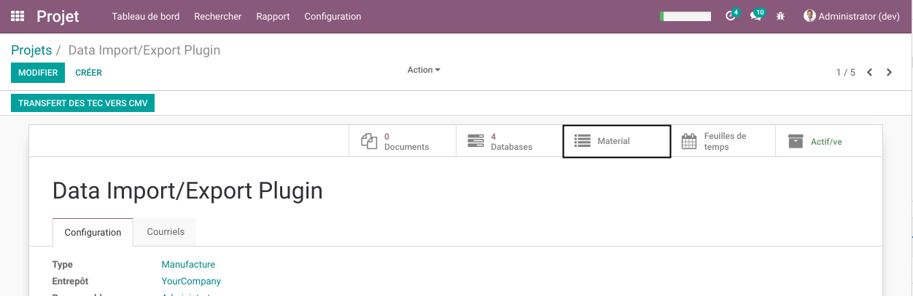

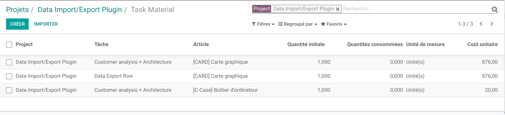

Contributors
------------
* Numigi (tm) and all its contributors (https://bit.ly/numigiens)
