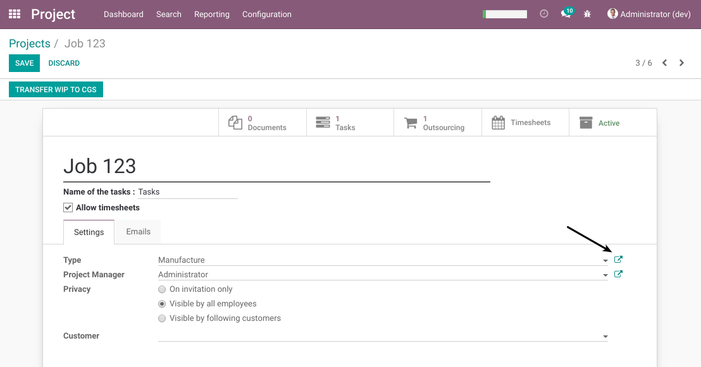
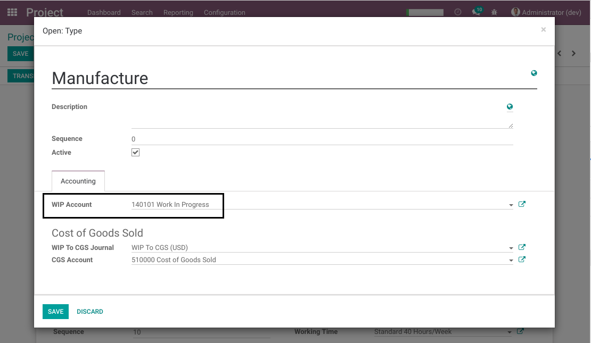
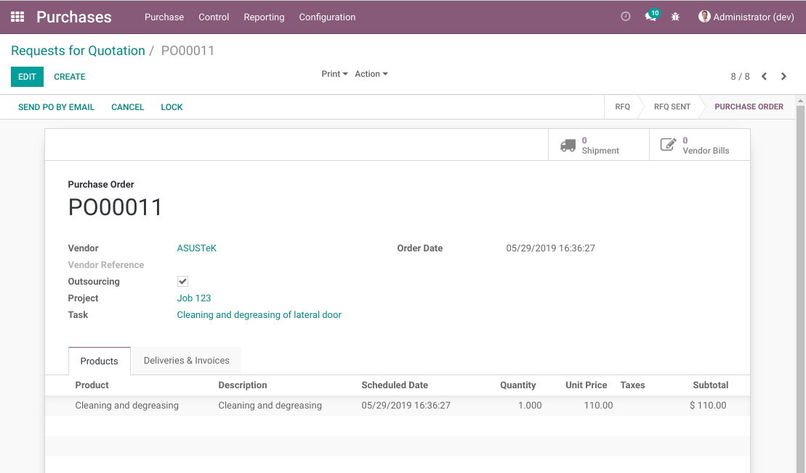
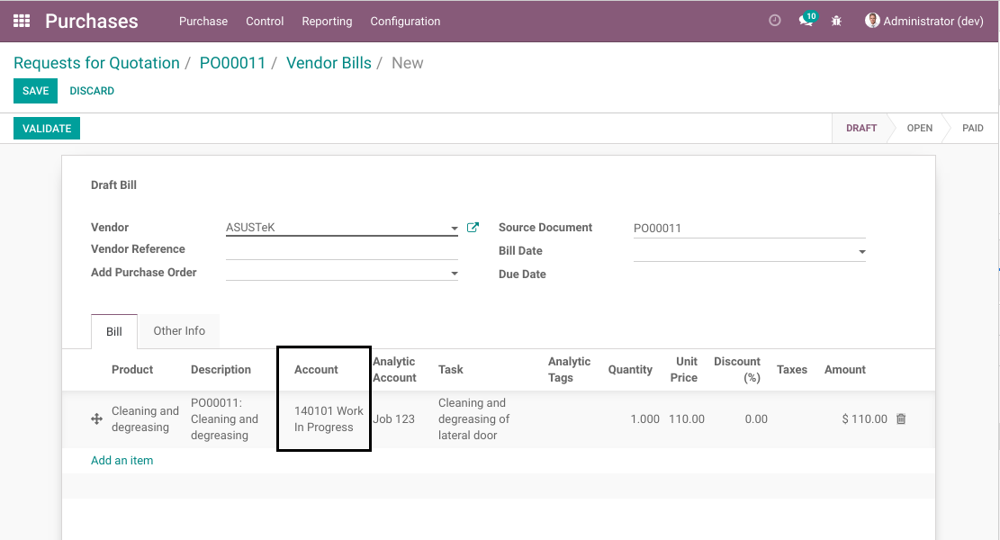

Project WIP Outsourcing
=======================

.. contents:: Table of Contents

Context
-------
In the context of a company using a `Work In Progress` account to capitalize expenses,
an outsourcing supplier invoice should be recognized in a WIP account.

Summary
-------
This module automatically sets the WIP account from the project type on an outsourcing invoice line.

Configuration
-------------
As member of the group `Project / Manager`, In the form view of a project type, I fill the WIP account.

Usage
-----
As member of the group `Purchase / User`, I create and validate an outsourcing PO.

I create an invoice from the PO. I notice that the WIP account from the project type was set on the invoice line.

Contributors
------------
* Numigi (tm) and all its contributors (https://bit.ly/numigiens)
