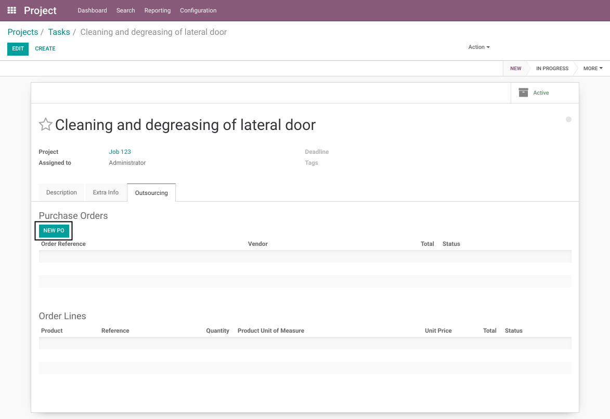
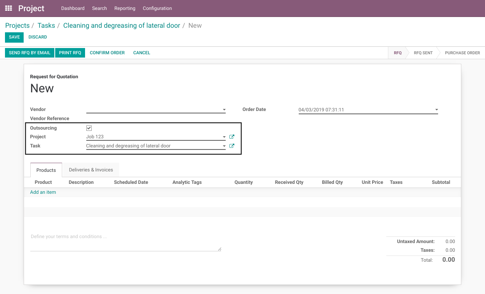
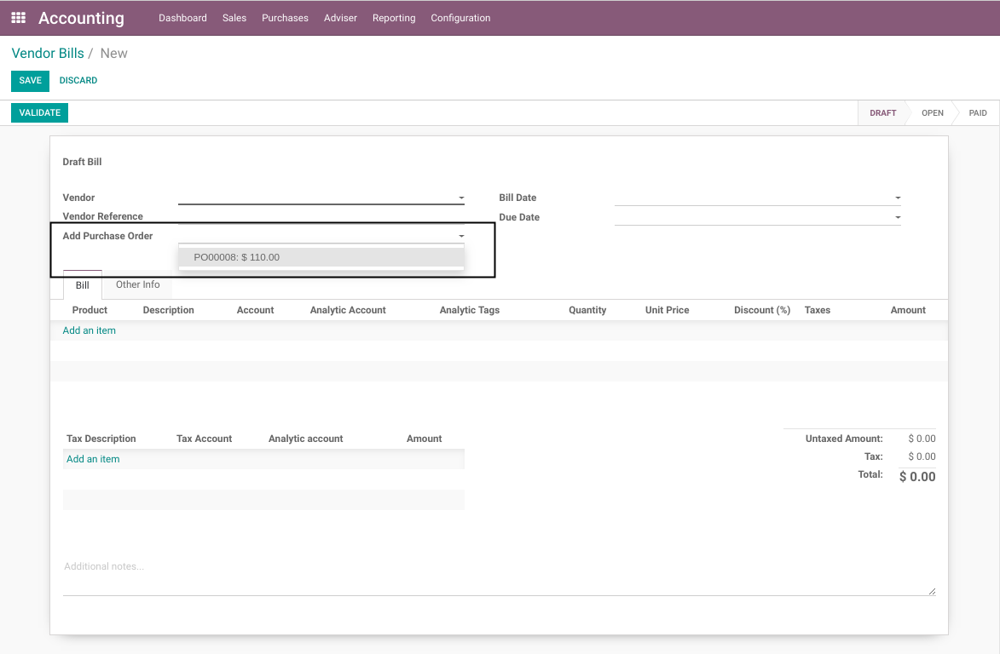
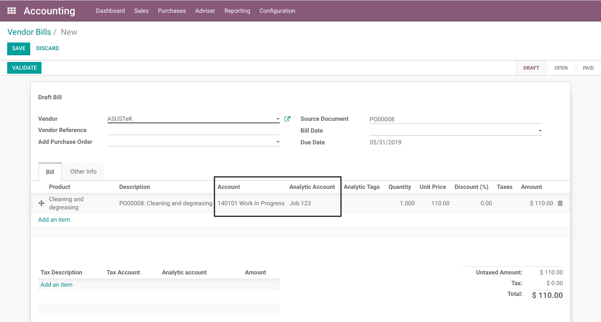
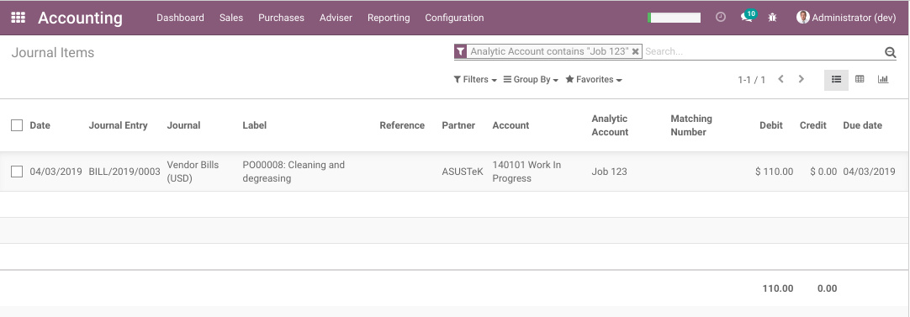

Project WIP Outsourcing
=======================
This module extends the project_wip (Project Work in Progress) module.

It allows to generate WIP journal entries from outsourcing (supplier) invoices.

Create A New PO
---------------
As member of the groups `Project / User` and `Purchase / User`, I go to the form view of a task.

In the `Outsourcing` tab, I see a list of purchase orders.

I click on the button `Create PO`.

The form view of a new PO is opened.

The following fields are filled automatically.

Outsourcing
~~~~~~~~~~~
This box is checked to indicate that the purchase order is an Outsourcing PO.

.. image:: static/description/po_outsourcing_field.png

Project
~~~~~~~
This field is visible because the `Outsourcing` box is checked.

It indicates which project is bound to the PO.

One outsourcing PO can not be bound to more than one project.

.. image:: static/description/po_project_field.png

Task
~~~~
This field is visible because the `Outsourcing` box is checked.

It indicates which task is bound to the PO.

It allows only to select a task from the selected project.

.. image:: static/description/po_task_field.png

Analytic Account
----------------
I notice that the analytic account on the PO lines is readonly.
This is because the `Outsourcing` box is checked.

.. image:: static/description/po_analytic_account.png

The analytic account is automatically set based on the selected project.

Stockable Products
------------------
Stockable (or consummable) products may not be added to an outsourcing PO.

This is because the accounting is very different between outsourcing and material.

* For outsourcing, WIP entries are generated by the supplier invoice.
* For material, WIP entries are generated at the consumption (NOT at the supplier invoice).

PO lines with stockable products must never contain an analytic account.
Otherwise, 2 analytic lines will be created (one at the supplier invoice and one at the consumption).

Supplier Invoice
----------------
As member of the group `Accounting / Billing`, I add a new vendor bill for the outsourcing PO.

.. image:: static/description/po_vendor_bill_button.png

I notice that the WIP account was selected on the invoice line.

After validating the vendor bill, I go to the general ledger and filter to see only my project.

I find one WIP entry for the outsourcing.

I go to the list of analytic lines. I find one analytic line for the outsourcing in my project.

How The Module Works
--------------------
If you create a vendor bill without selecting a PO, the wip account will not be selected on the invoice lines.

If you select a PO which has not the box `Outsourcing` checked, the wip account will not be selected.

If you select a PO with the box checked, the wip account from the project type will be set automatically on the invoice line.
If you try to change this account manually, an error message will be raised.

.. image:: static/description/vendor_bill_wrong_account_message.png

Also, if you try to set an analytic account different from the PO, an error message will be raised as well.

Contributors
------------
* Numigi (tm) and all its contributors (https://bit.ly/numigiens)
