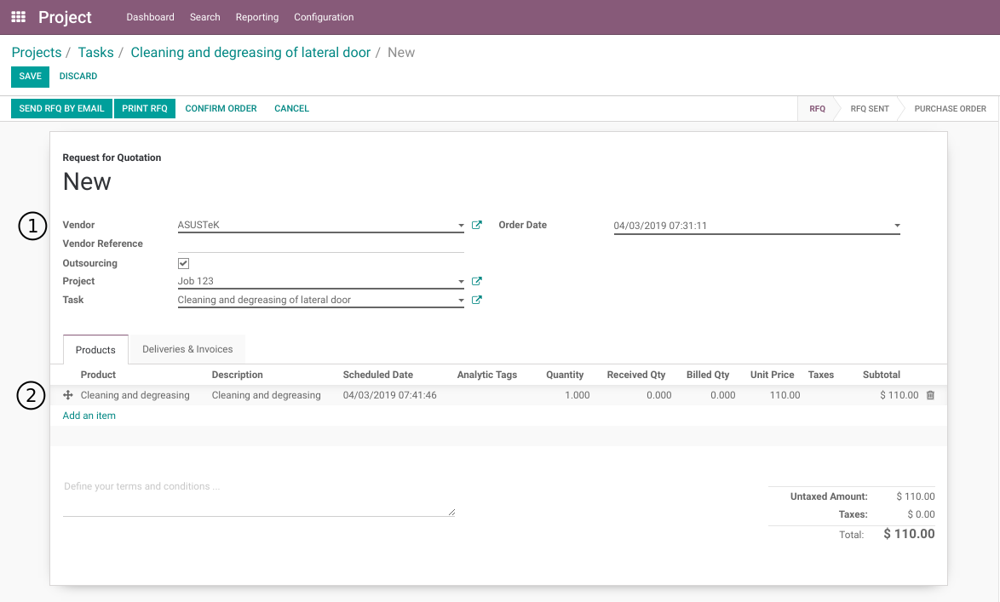
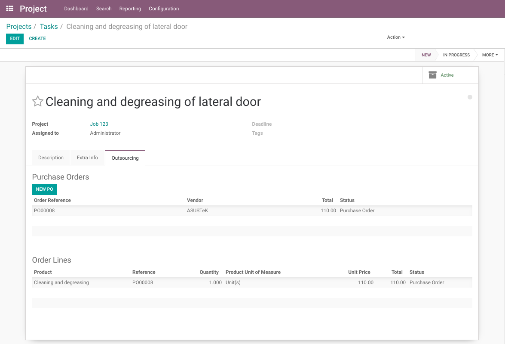
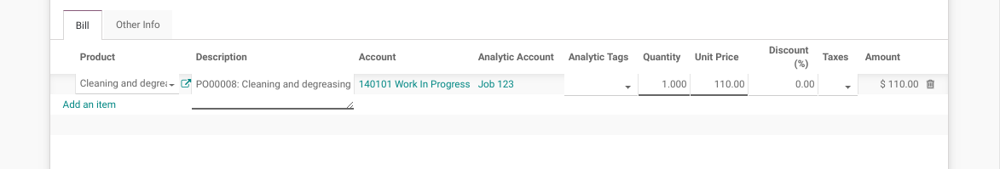
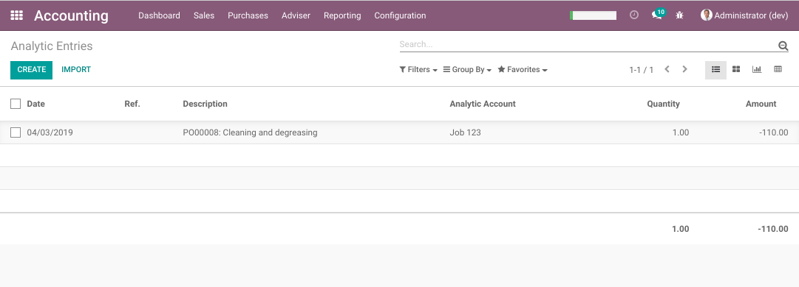
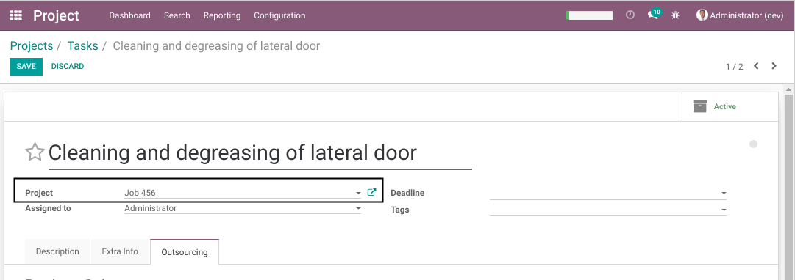
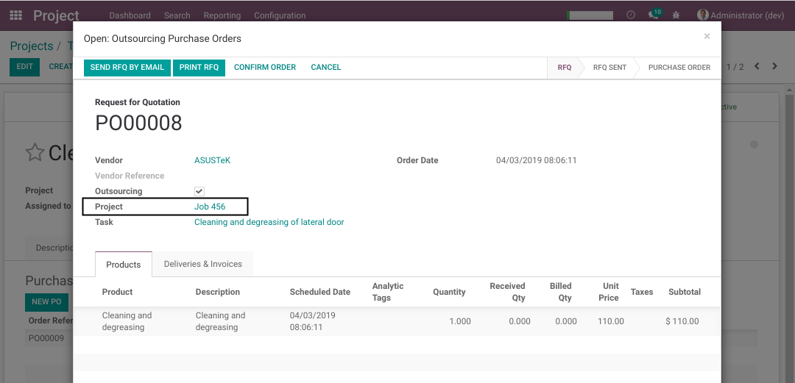
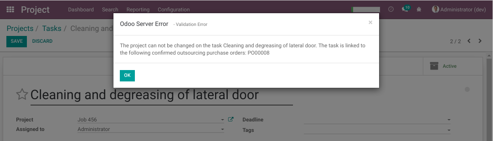
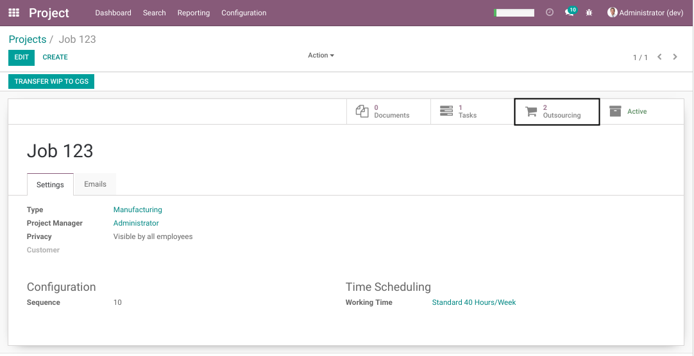
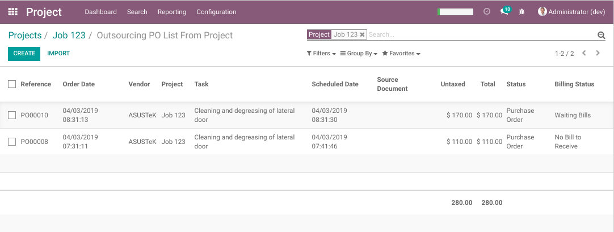
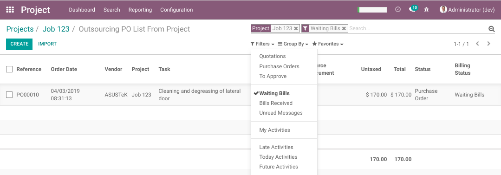

Project WIP Outsourcing
=======================
This module extends the project_wip (Project Work in Progress) module.

It allows to generate WIP journal entries from outsourcing (supplier) invoices.

Create A New PO
---------------
As member of the groups `Project / User` and `Purchase / User`, I go to the form view of a task.

In the `Outsourcing` tab, I see a list of purchase orders.

.. image:: static/description/project_task_form.png

I click on the button `Create PO`.

The form view of a new PO is opened.

.. image:: static/description/new_purchase_order.png

The following fields are filled automatically.

* Outsourcing

..

    This box is checked to indicate that the purchase order is an Outsourcing PO.

* Project

..

    This field is visible because the `Outsourcing` box is checked.
    
    It indicates which project is bound to the PO.
    
    One outsourcing PO can not be bound to more than one project.

* Task

..

    This field is visible because the `Outsourcing` box is checked.

    It indicates which task is bound to the PO.

    It allows only to select a task from the selected project.

I select my supplier, then I add a new line to the PO.

Analytic Account
~~~~~~~~~~~~~~~~
I notice that the analytic account on the PO lines is invisible.
This is because the `Outsourcing` box is checked.

Behind the scene, the analytic account is automatically set based on the selected project.

Stockable Products
------------------
Stockable (or consummable) products may not be added to an outsourcing PO.

This is because the accounting is very different between outsourcing and material.

* For outsourcing, WIP entries are generated by the supplier invoice.
* For material, WIP entries are generated at the consumption (NOT at the supplier invoice).

PO lines with stockable products must never contain an analytic account.
Otherwise, 2 analytic lines will be created (one at the supplier invoice and one at the consumption).

List Of Purchase Lines
----------------------
Back to the task, in the outsourcing tab, I notice the new PO in the `Purchase Order` table and one line in the `Order Lines` table.

Supplier Invoice
----------------
As member of the group `Accounting / Billing`, I create a new vendor bill and select my PO in the field `Add Purchase Order`.

.. image:: static/description/vendor_bill.png

I notice that the WIP account was automatically selected on the invoice line.

.. image:: static/description/vendor_bill_wip_account.png

I can not change the GL account or the analytic account.

After validating the vendor bill, I go to the general ledger and filter to see only my project.

I find one WIP entry for the outsourcing.

.. image:: static/description/general_ledger_filtered.png

I go to the list of analytic lines. I find one analytic line for the outsourcing in my project.

How The Module Works
~~~~~~~~~~~~~~~~~~~~
If you create a vendor bill without selecting a PO, the WIP account will not be selected on the invoice lines.

If you select a PO which has not the box `Outsourcing` checked, the WIP account will not be selected either.

If you select a PO with the box checked, the WIP account from the project type will be set automatically on the invoice line.

Changing The Project
--------------------
If a task is moved from a project to another, any outsourcing PO linked to the task will be moved to the destination project.

If any PO is already confirmed, a blocking message will be displayed.

Project Smart Button
--------------------
When confirming a purchase order, journal entries are not created.
The journal entries and analytic lines are only created when validating the supplier invoice.

The supplier invoice for an outsourcing task may not be received before the job is finished.
Therefore, that cost needs to be included in the customer invoice.

For this purpose, a smart button is added on the project.

The button indicates the number of outsourcing purchase orders related to the project.

When clicking on the button, the list of purchase orders is displayed.

From this list I can filter to see only the orders awaiting a vendor bill.

Contributors
------------
* Numigi (tm) and all its contributors (https://bit.ly/numigiens)
