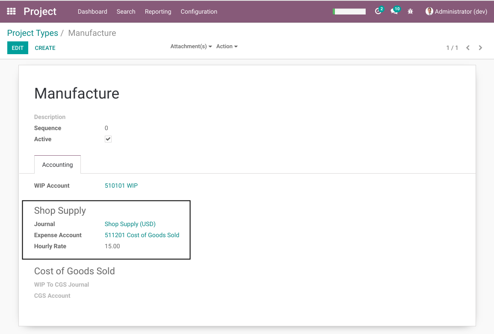
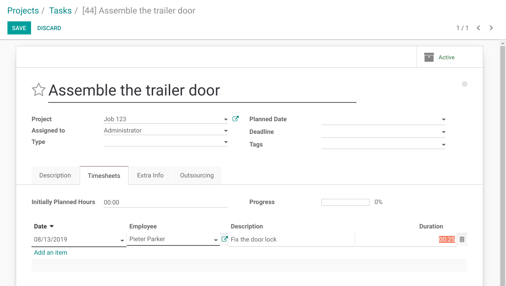
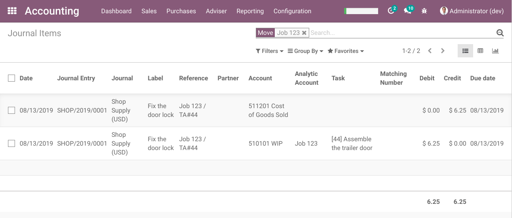
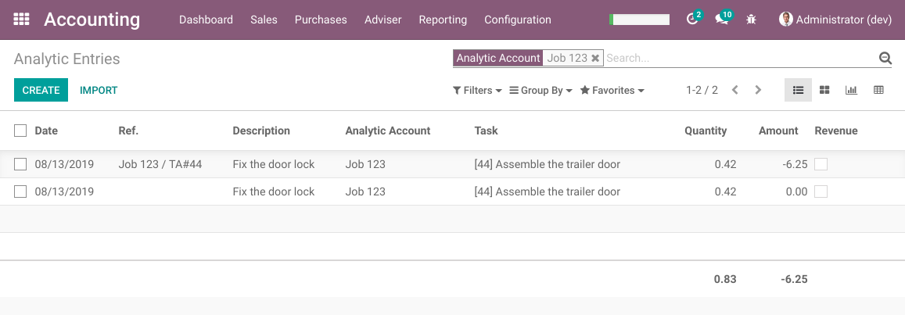

Project WIP Supply Cost
=======================
This module extends the project_wip (Project Work in Progress) module.

It allows to generate journal entries for indirect costs (supply cost) from timesheet lines.

.. contents:: Table of Contents

Configuration
-------------
As member of the group ``Project / Manager``, I go to the form view of a project type.

I notice a new section ``Indirect Costs`` with the following fields:

* Expense Account

..

    The counter-part account to use for the shop supply entries.

* Journal

..

    The journal to use for the shop supply entries.

* Hourly Rate

..

    The hourly rate to apply.

    The shop supply entry for a timesheet has an amount equal to ``Number of Hours`` x ``Hourly Rate``.

When the field ``Expense Account`` is filed, a shop supply entry will be created for each new timesheet line under the project type.

Usage
-----
As member of the group `Project / User`, I go to the form view of a task.

I add a timesheet line.

Journal Entries
~~~~~~~~~~~~~~~
As member of the group `Accounting / Billing`, I go to the general ledger and filter to see only entries for my project.

I see one entry for my timesheet line.

The amount of 6.25 USD represents 25 minutes (0.417 hours) x 15 USD (timesheet cost).

Analytic Lines
~~~~~~~~~~~~~~
I go to the list of analytic lines and I filter to see only entries for my project.

I notice that 2 analytic line were generated for my timesheet line.

The first line is the shop supply (6.25 USD).

The second line is the timesheet line itself.
Note that the amount is 0.00 USD. The reason is that the timesheet cost was not defined on the employee.

Deleting / Updating Timesheets
------------------------------
When deleting or updating a timesheet line, the behavior is equivalent as with the module ``project_wip_timesheet``.

The shop supply journal entries and analytic lines are resersed / updated in cascade.

If however, the WIP entry was already transfered to the cost of goods sold, then deleting or updating
the timesheet line will be blocked.

Contributors
------------
* Numigi (tm) and all its contributors (https://bit.ly/numigiens)
