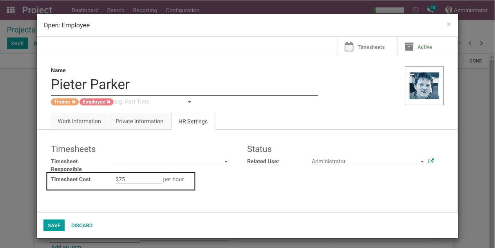
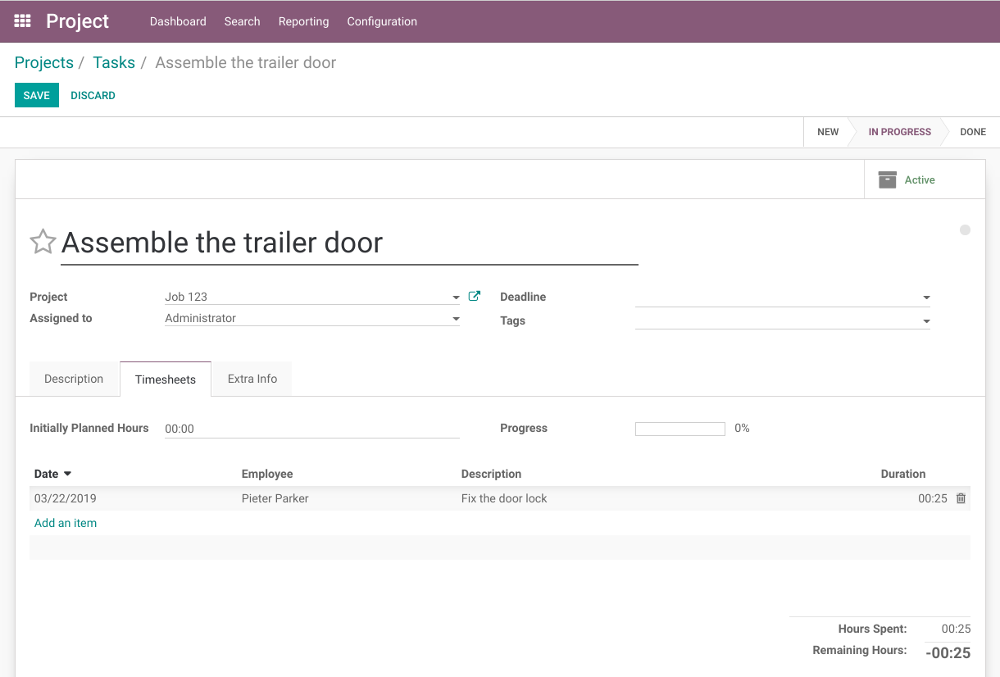
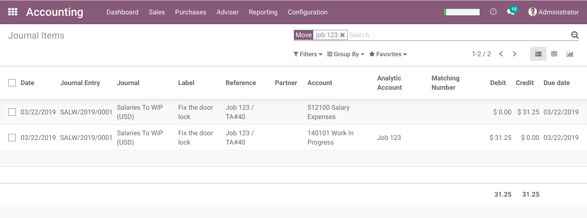
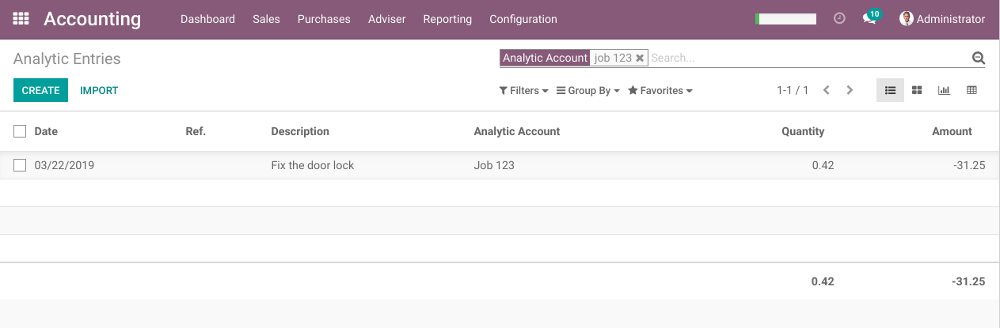
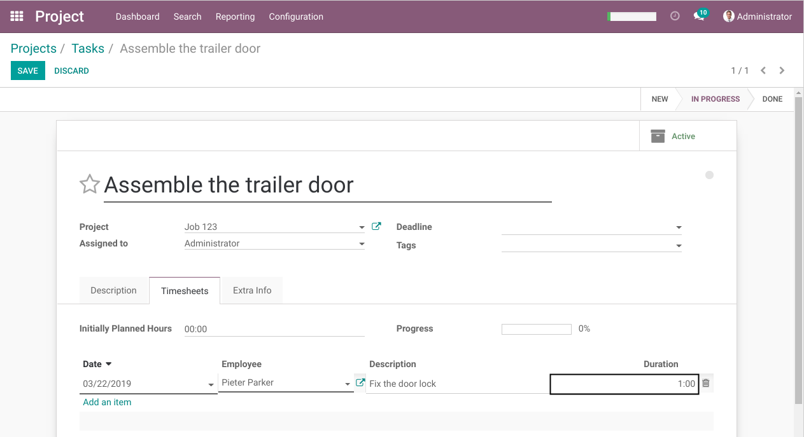
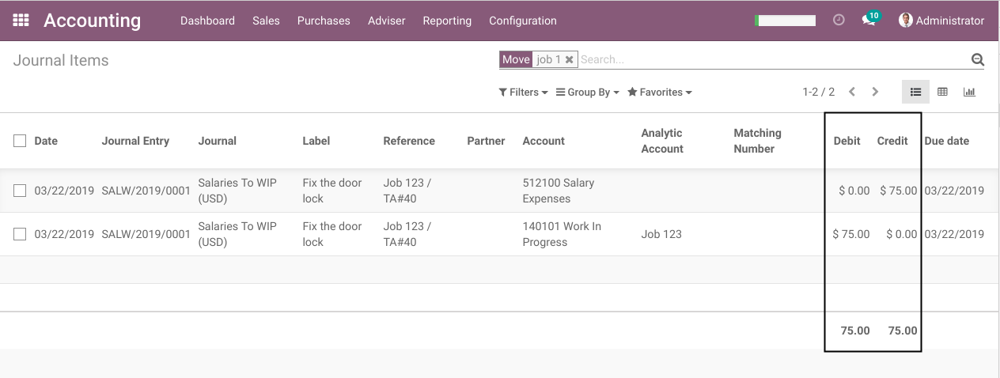
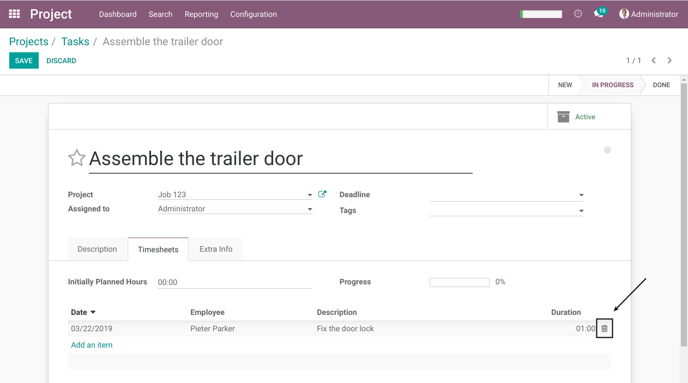
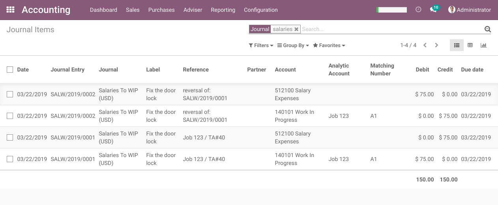

Project WIP Timesheet
=====================
This module extends the project_wip (Project Work in Progress) module.

It allows to automatically generate WIP journal entries from timesheet entries.

Configuration
-------------
As member of the group `Project / Manager`, I go to the form view of a project type.

I notice 2 new fields:

* Salary Account
* Salary Journal

.. image:: static/description/project_type.png

These 2 fields allow to define the salary account and journal to use in WIP journal entries generated from timesheets.

If these fields are not filled, no journal entry will be generated by the timesheets for this project type.

Employees
~~~~~~~~~
As member of the group `Human Resources / Manager`, I set a timesheet cost for every employee.

This cost will be used in timesheets to transfer amounts from salaries to work in progress.

Usage
-----
As member of the group `Project / User`, I go to the form view of a task.

I add a timesheet line.

As member of the group `Accounting / Billing`, I go to the general ledger and filter to see only entries for my project.

I see one entry for my timesheet line.

The amount of 31.25 USD represents 25 minutes (0.417 hours) x 75 USD (timesheet cost).

I go to the list of analytic lines and I filter to see only entries for my project.

Updating A Timesheet Line
-------------------------
When modifying an existing timesheet line, the journal entry is updated (if required).

For example, I modify the quantity on my timesheet line:

The amount is updated on the journal entry:

Deleting A Timesheet Line
-------------------------
When deleting a timesheet line, the journal entry is reversed.

WIP Entries Transfered To CGS
-----------------------------
If a `WIP / Salary` journal entry is already transfered to CGS (cost of goods sold),
the timesheet line can not be updated or deleted.

If a user attempts to update such timesheet line, the following blocking message will appear:

.. image:: static/description/timesheet_line_updated_error_message.png

Contributors
------------
* Numigi (tm) and all its contributors (https://bit.ly/numigiens)
