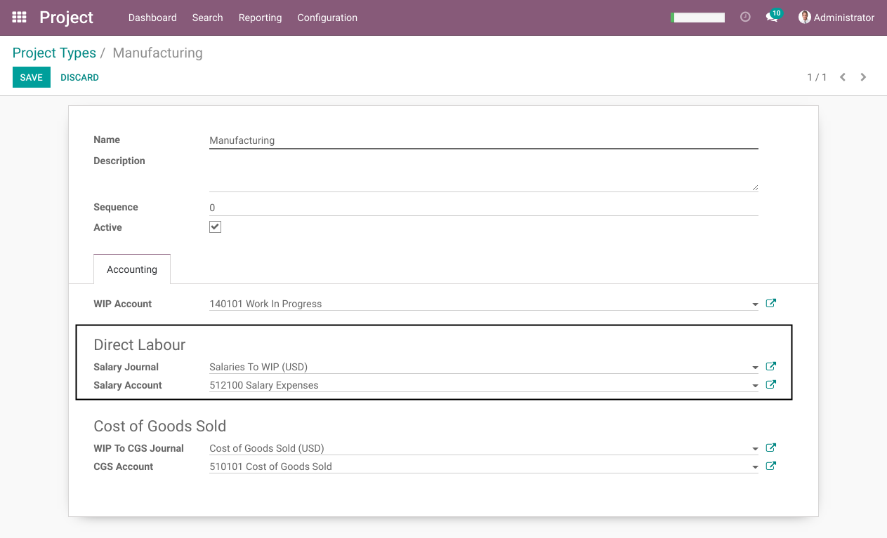

Project WIP Timesheet
=====================
This module extends the project_wip (Project Work in Progress) module.

It allows to automatically generate WIP journal entries from timesheet entries.

Configuration
-------------
As member of the group `Project / Manager`, I go to the form view of a project type.

I notice 2 new fields:

* Salary Account
* Salary Journal

These 2 fields allow to define the salary account and journal to use in WIP journal entries generated from timesheets.

Contributors
------------
* Numigi (tm) and all its contributors (https://bit.ly/numigiens)
