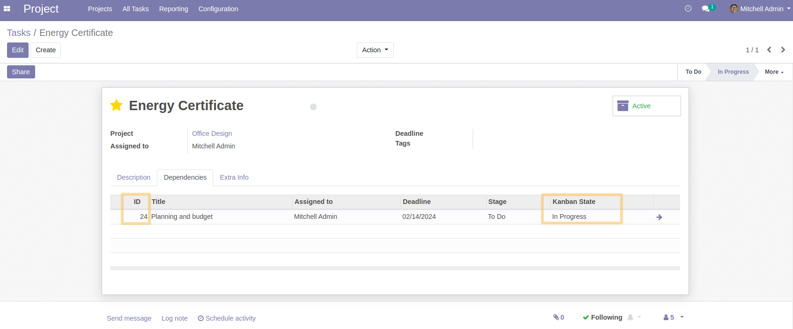

Task Info In Dependencies Tree View
===================================
This module allow to show the ID of each task listed in the dependencies as well as their kanban states.

Usage
-----
As an Isidor user with `project/User` access rights, when I access a task and consult the `Dependencies` tab, 
I notice that two fields have been added to the list view.

Contributors
------------
* Numigi (tm) and all its contributors (https://bit.ly/numigiens)
